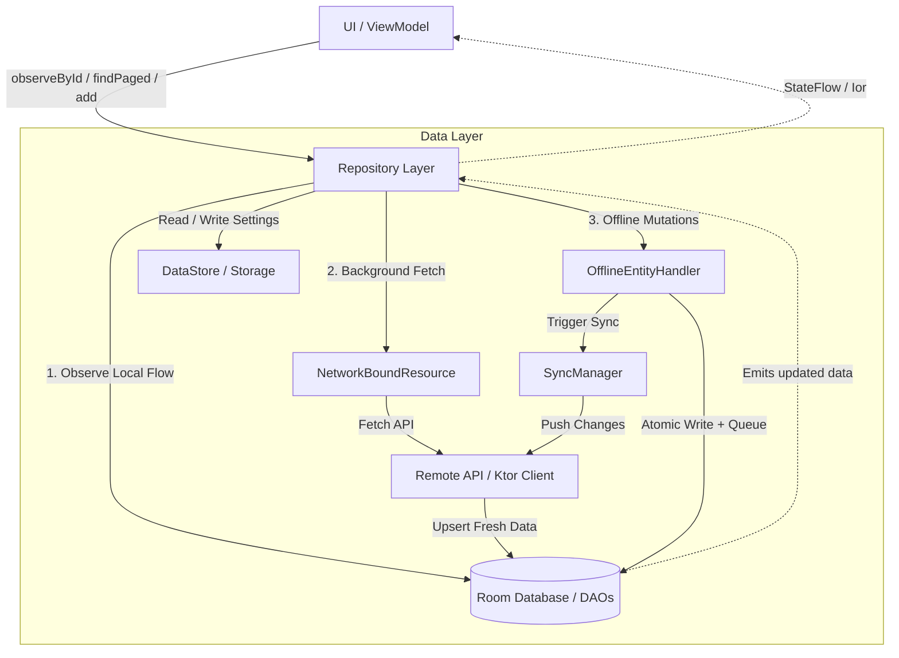

# Data Layer Architecture & Guidelines

This document provides a comprehensive guide to the **Data Layer** in the Kotlin Multiplatform (KMP) template. The data layer is designed around an **Offline-First, Single Source of Truth (SSOT)** architecture with reactive caching ([Arrow `Either`](https://arrow-kt.io/learn/typed-errors/either-and-ior/) / [`Ior`](https://arrow-kt.io/learn/typed-errors/either-and-ior/)), bidirectional local pagination, and background mutation synchronization.

---

## 1. Overview & Data Flow



### Core Architectural Principles
1. **Single Source of Truth (SSOT)**: The local Room database is the authoritative source for domain reads. Remote API calls update the local database; UI collectors automatically receive updates via Room reactive flows.
2. **Offline-First Resilience**: Reading cached data is never blocked by network failures. Background sync failures surface as non-fatal notifications without discarding displayed data (`Ior.Both` / `CacheableResource.Cached`).
3. **Clean Separation of Concerns**:
   - **API**: Network transport and serialization.
   - **DAOs / Room**: Local SQLite persistence and queries.
   - **DataStore**: Key-value settings and token storage.
   - **Offline Handlers**: Queued offline mutations and conflict-free syncing.
   - **Paginator**: Windowed local database streaming and network page fetching.
   - **Repository**: High-level facade coordinating all data sources.

---

## 2. Remote API Layer (Ktor Client)

The API layer is split between **contract definitions / DTOs** in `common` and HTTP client implementations in `kmp-app/shared`.

### 2.1. Template Abstractions & Result Types
Located in: [`ApiResult.kt`](file:///E:/Dev/AndroidStudioProjects/Finni/shared/src/commonMain/kotlin/com/hackathon/finni/api/response/ApiResult.kt)

- **`ApiResult<T>`**: Typealias for `Either<ApiError, T>`.
- **`EmptyApiResult`**: Typealias for `Either<ApiError, Unit>`.
- **`HttpResponse.toResult<T>()`**: Parses HTTP response into `Right(body<T>())` for 2xx codes or `Left(body<ApiError>())` for HTTP error status codes.
- **`safeFetch { api.call() }`**: Wraps API invocations into `RequestResult<T>` (`Either<Failure, T>`), catching network connection issues (`NoConnection`), timeouts (`Timeout`), and serializing HTTP errors into `ApiFailure`.

```kotlin
typealias ApiResult<T> = Either<ApiError, T>
typealias EmptyApiResult = ApiResult<Unit>

// Safe fetch wrapper in NetworkBoundResource.kt
suspend inline fun <T> safeFetch(
    request: suspend () -> ApiResult<T>
): RequestResult<T> = try {
    request().mapLeft { ApiFailure(it) }
} catch (t: Throwable) {
    t.asFailure().left()
}
```

### 2.2. Concrete API Example: `NoteApi`
Located in: [`NoteApi.kt`](file:///E:/Dev/AndroidStudioProjects/Finni/shared/src/commonMain/kotlin/com/hackathon/finni/api/note/NoteApi.kt)

```kotlin
class NoteApi(private val client: HttpClient) {

    suspend fun getList(
        offset: Int,
        limit: Int,
        filter: NoteFilter = NoteFilter()
    ): ApiResult<List<NoteResponse>> {
        return client.get("/notes") {
            parameter("offset", offset)
            parameter("limit", limit)
            parameter("q", filter.searchQuery.takeIf { it.isNotBlank() })
            parameter("sort", filter.sortOrder.name)
        }.toResult()
    }

    suspend fun getById(id: NoteId): ApiResult<NoteResponse> {
        return client.get("/notes/${id.value}").toResult()
    }

    suspend fun create(request: NoteRequest): ApiResult<NoteResponse> {
        return client.post("/notes") {
            contentType(ContentType.Application.Json)
            setBody(request)
        }.toResult()
    }

    suspend fun delete(id: NoteId): EmptyApiResult {
        return client.delete("/notes/${id.value}").toEmptyResult()
    }
}
```

---

## 3. Local Database & Room Layer

The local database layer is built using **Room Multiplatform** (`androidx.room`).

### 3.1. Database Definition & Transactions
Located in: `com.hackathon.finni.data.database`

- **`AppDatabase`**: Room database defining DAOs and entity tables.
- **`database.withTransaction { ... }`**: Extension function ensuring atomic multi-table or multi-step operations.

### 3.2. Entity Pattern
Entities represent database tables and include synchronization metadata (`syncStatus`, `globalIndex`, `createdAt`, `updatedAt`).

Example: `NoteEntity`
```kotlin
@Entity(tableName = "notes")
@Serializable
data class NoteEntity(
    @PrimaryKey val noteId: NoteId,
    val title: String,
    val content: String,
    val projectId: ProjectId?,
    val tagIds: List<TagId>,
    val isPinned: Boolean,
    val isArchived: Boolean,
    val isDeleted: Boolean,
    val hasReminder: Boolean,
    val createdAt: Instant,
    val updatedAt: Instant,
    val syncStatus: SyncStatus,
    val globalIndex: Int // Preserves server-side pagination ordering in local DB
)
```

### 3.3. DAO Pattern (Data Access Objects)
Located in: [`NoteDao.kt`](file:///E:/Dev/AndroidStudioProjects/Finni/shared/src/commonMain/kotlin/com/hackathon/finni/data/database/dao/NoteDao.kt)

DAOs are structured with two distinct querying styles:
1. **One-shot Suspend Methods**: For mutations and internal sync (`getById`, `upsert`, `delete`, `softDelete`).
2. **Reactive Flow Methods**: For UI data observation (`observeById`, `observeByPages`, `countAll`).
3. **Atomic Range / Page Replacement**: Transactional methods to replace local page ranges when fresh server data arrives.

```kotlin
@Dao
interface NoteDao {
    @Upsert
    suspend fun upsert(notes: List<NoteEntity>)

    @Query("SELECT * FROM notes WHERE note_id = :id")
    fun observeById(id: NoteId): Flow<NoteEntity?>

    @Query("UPDATE notes SET is_deleted = 1, sync_status = :syncStatus WHERE note_id = :noteId")
    suspend fun softDelete(noteId: NoteId, syncStatus: SyncStatus)

    @Query("DELETE FROM notes WHERE global_index BETWEEN :fromIndex AND :toIndex")
    suspend fun deleteRange(fromIndex: Int, toIndex: Int)

    @Transaction
    suspend fun replacePage(fromIndex: Int, toIndex: Int, entities: List<NoteEntity>) {
        deleteRange(fromIndex, toIndex)
        upsert(entities)
    }
}
```

---

## 4. Key-Value & Storage Layer (DataStore)

Located in: `com.hackathon.finni.data.storage`

The application distinguishes between simple UI preferences and typed/secure authentication credentials:

### 4.1. `AppSettingsStorage` (Preferences DataStore)
Used for scalar preferences (e.g. app theme, onboarding status).
```kotlin
class AppSettingsStorage(private val dataStore: DataStore<Preferences>) {
    val settings: Flow<AppSettings> = dataStore.data.map { prefs ->
        AppSettings(
            themeMode = prefs[THEME_MODE]?.let { ThemeMode.valueOf(it) } ?: ThemeMode.SYSTEM,
            isOnboardingCompleted = prefs[IS_ONBOARDING_COMPLETED] ?: false
        )
    }

    suspend fun updateSettings(transform: (AppSettings) -> AppSettings) {
        dataStore.edit { prefs -> ... }
    }
}
```

### 4.2. `AuthSettingsStorage` (Typed DataStore)
Used for auth tokens (`token`, `refreshToken`) backed by a custom `KSerializer<AuthSettings>`.
```kotlin
@Serializable
data class AuthSettings(
    val token: String? = null,
    val refreshToken: String? = null
)

class AuthSettingsStorage(private val dataStore: DataStore<AuthSettings>) {
    val token: Flow<String?> = dataStore.data.map { it.token }
    suspend fun updateSettings(transform: (AuthSettings) -> AuthSettings) = dataStore.updateData(transform)
    suspend fun clear() = dataStore.updateData { AuthSettings() }
}
```

---

## 5. Reactive Caching Layer (`NetworkBoundResource`)

Located in: [`NetworkBoundResource.kt`](file:///E:/Dev/AndroidStudioProjects/Finni/shared/src/commonMain/kotlin/com/hackathon/finni/core/network/NetworkBoundResource.kt)

`NetworkBoundResource` implements declarative caching by combining local database `Flow` with remote network queries using Arrow `Ior<Failure, T>`.

### 5.1. `observeData`
Streams cached data immediately, fetches remote data in the background, updates the database on success, or emits `Ior.Both(failure, cachedData)` on network error:

```kotlin
fun <T> observeData(
    query: Flow<T>,
    fetch: suspend () -> ApiResult<*>,
    shouldFetch: (T) -> Boolean = { true },
    waitFetchResult: Boolean = false
): Flow<Ior<Failure, T>>
```

**Lifecycle of `observeData`**:
1. Emits current cached data from `query` as `Ior.Right(first)` (unless `waitFetchResult = true`).
2. Invokes `fetch()` if `shouldFetch(first)` returns `true`.
3. If fetch succeeds: Database is updated by caller; the updated Room flow emits new data as `Ior.Right(updatedData)`.
4. If fetch fails: Emits `Ior.Both(failure, cachedData)` — UI keeps displaying cached data while showing a non-blocking error badge/snackbar.

### 5.2. `findData`
One-shot suspending version of `observeData` returning `Ior<Failure, T>`:
```kotlin
suspend fun <T> findData(
    query: suspend () -> T,
    fetch: suspend () -> ApiResult<*>,
    shouldFetch: (T) -> Boolean = { true }
): Ior<Failure, T>
```

---

## 6. Pagination Layer (`Paginator`)

Located in: [`Paginator.kt`](file:///E:/Dev/AndroidStudioProjects/Finni/shared/src/commonMain/kotlin/com/hackathon/finni/core/paginator/Paginator.kt)

The project includes an **offline-first windowed paginator** that coordinates local database observation with remote page fetching.

### 6.1. Mechanics
- **`observeLocalPages`**: The DAO observes only active page slices (`activePages: Set<Int>`) using `observeByPages(...)`.
- **`fetchPage`**: Suspending lambda that queries the remote API by page/offset and replaces the local index slice via `dao.replacePage(...)`.
- **`FetchStrategy`**:
  - `NetworkFirstWithFallback` *(default)*: Fetches remote API; displays cache + error if network fails.
  - `NetworkFirstGuarded`: Fails without modifying active local pages.
  - `StaleWhileRevalidate`: Displays local cache immediately and fetches remote page asynchronously.
  - `CacheOnly`: Modifies active pages locally without hitting the network.

### 6.2. UI State & Paging Controls
- **`uiState: Flow<PaginatorUIState<T>>`**:
  - `Loading`: Initial loading state.
  - `Content(items, appendState, prependState, error)`: Loaded items list with append/prepend progress.
  - `Error(exception)`: Fatal initial loading error.
- **Controls**: `loadNext()`, `loadPrevious()`, `restart()`, `refresh()`, `retry()`.

---

## 7. Offline Handlers & Background Sync Layer

Located in: `com.hackathon.finni.data.sync`

Allows immediate optimistic local mutations (create, update, delete) while queuing operations for background synchronization when offline.

### 7.1. `OfflineEntityHandler<ID, T>`
Abstract base class for entity sync:
```kotlin
abstract class OfflineEntityHandler<ID : Any, T : Any>(
    private val database: AppDatabase,
    private val queueDao: SyncQueueDao
) {
    abstract val serializer: KSerializer<T>
    abstract val idSerializer: KSerializer<ID>

    abstract suspend fun localSave(id: ID, data: T, status: SyncStatus)
    abstract suspend fun localDelete(id: ID, status: SyncStatus)

    abstract suspend fun remoteCreate(id: ID, data: T): ApiResult<T>
    abstract suspend fun remoteUpdate(id: ID, data: T): ApiResult<T>
    abstract suspend fun remoteDelete(id: ID): EmptyApiResult

    suspend fun create(id: ID, entity: T, extraLocalWork: suspend () -> Unit = {}): RequestResult<T>
    suspend fun update(id: ID, entity: T): RequestResult<T>
    suspend fun delete(id: ID, entity: T): RequestResult<T>
}
```

### 7.2. Mutation Flow
When `handler.create(...)`, `update(...)`, or `delete(...)` is called:
1. **Atomic Local Write**: Inside `database.withTransaction`:
   - Saves entity locally with status `SyncStatus.PENDING_CREATE` / `PENDING_UPDATE` / `PENDING_DELETE`.
   - Inserts serialized task into `SyncQueueDao`.
2. **Immediate Sync Trigger**: Dispatches task to `SyncManager`.
   - If online $\rightarrow$ Remote API is called; on success, entry is removed from queue and entity status becomes `SyncStatus.SYNCED`.
   - If offline $\rightarrow$ Returns `SyncResult.Queued` (treated as local success `data.right()`).
3. **Automatic Background Sync**: `SyncManager` monitors `NetworkObserver` and `AppLifecycleObserver`. When the network reconnects or the app returns to the foreground, queued tasks are processed sequentially.

---

## 8. Repository Layer (Coordinator & Facade)

The Repository is the single entry point for ViewModels, bringing together the API, DAO, Offline Handler, and Paginator.

### Concrete Example: [`NoteRepository.kt`](file:///E:/Dev/AndroidStudioProjects/Finni/shared/src/commonMain/kotlin/com/hackathon/finni/data/repository/NoteRepository.kt)

```kotlin
class NoteRepository(
    private val noteApi: NoteApi,
    private val noteDao: NoteDao,
    private val noteHandler: NoteOfflineHandler,
    private val database: AppDatabase,
    private val appScope: CoroutineScope
) {
    companion object {
        private const val NOTE_PAGE_SIZE = 20
    }

    // 1. Synchronous optimistic mutation
    suspend fun add(createNote: CreateNote): RequestResult<NoteResponse> {
        val entity = createNote.toEntity(...)
        return noteHandler.create(
            id = entity.noteId,
            entity = entity,
            extraLocalWork = { noteDao.incrementGlobalIndexes() }
        ).map { it.toNoteResponse() }
    }

    // 2. Fire-and-forget background mutation
    fun addAsync(createNote: CreateNote) {
        appScope.launch { add(createNote) }
    }

    // 3. One-shot data retrieval with caching
    suspend fun findById(noteId: NoteId): Ior<Failure, NoteResponse?> = findData(
        query = { noteDao.getById(noteId)?.toNoteResponse() },
        fetch = { noteApi.getById(noteId) }
    )

    // 4. Reactive single-item observation with background sync
    fun observeById(noteId: NoteId): Flow<Ior<Failure, NoteResponse?>> = observeData(
        query = noteDao.observeById(noteId).map { it?.toNoteResponse() },
        fetch = {
            noteApi.getById(noteId).onRight { response ->
                database.withTransaction {
                    noteDao.upsert(response.toEntity(...))
                }
            }
        }
    )

    // 5. Windowed pagination
    fun findPaged(filter: NoteFilter = NoteFilter()): Paginator<NoteResponse> = Paginator(
        pageSize = NOTE_PAGE_SIZE,
        observeLocalPages = { activePages ->
            noteDao.observeByPages(pages = activePages, pageSize = NOTE_PAGE_SIZE, ...).map { pageMap ->
                pageMap.mapValues { entry -> entry.value.map { it.toNoteResponse() } }
            }
        },
        fetchPage = { page ->
            val offset = (page - 1) * NOTE_PAGE_SIZE
            safeFetch { noteApi.getList(offset, NOTE_PAGE_SIZE, filter) }
                .getOrThrow().let { notes ->
                    val entities = notes.mapIndexed { index, note -> note.toEntity(offset + index) }
                    noteDao.replacePage(
                        fromIndex = offset,
                        toIndex = offset + NOTE_PAGE_SIZE - 1,
                        entities = entities
                    )
                    notes.size
                }
        }
    )
}
```

---

## 9. Best Practices & Anti-patterns

### Best Practices
- ✅ **Always observe local DAO**: UI layers should collect data from Room Flows via the Repository, never directly calling the network without caching.
- ✅ **Use `database.withTransaction` for composite writes**: Ensure DAO upserts and sync queue modifications execute atomically.
- ✅ **Preserve `globalIndex` on paginated entities**: Store server-side order indices in Room entities so SQLite `ORDER BY global_index` matches remote sorting.
- ✅ **Use `safeFetch` / `safeObserve`**: Guard network calls against uncaught connection exceptions and convert them into domain `Failure` models.
- ✅ **Separate `AppSettingsStorage` from `AuthSettingsStorage`**: Keep unencrypted UI preferences in Preferences DataStore and typed credentials in typed DataStore.

### Anti-patterns
- ❌ **Direct API calls in ViewModels**: Bypassing Repository/DAO leads to broken offline states and UI desynchronization.
- ❌ **Throwing raw HTTP exceptions in Repositories**: Return `RequestResult<T>` (`Either<Failure, T>`) or `Ior<Failure, T>` instead of throwing runtime exceptions.
- ❌ **Ignoring `SyncStatus` in queries**: Ensure soft-deleted (`is_deleted = 1` / `PENDING_DELETE`) items are excluded from active list queries until permanently removed.
- ❌ **Re-fetching full list without pagination**: For entity collections with more than 20–50 items, always use `Paginator` with local page observation.

---

## 10. Date, Time & Serialization Standards

### 10.1. `kotlin.time` vs `kotlinx.datetime`

> [!IMPORTANT]
> **Use `kotlin.time` for timestamps and clocks.**
> Starting with Kotlin 2.1+ and `kotlinx-datetime 0.7.0+ / 0.8.0+`, **`Instant`** and **`Clock`**
> belong to the standard library (`kotlin.time.Instant`, `kotlin.time.Clock`).
> In `kotlinx.datetime`, `kotlinx.datetime.Instant` and `kotlinx.datetime.Clock` are **deprecated**.

| Concept                     | Recommended API                  | Deprecated / Avoid                                |
|-----------------------------|----------------------------------|---------------------------------------------------|
| **Timestamp / Epoch**       | `kotlin.time.Instant`            | ❌ `kotlinx.datetime.Instant` *(deprecated)*       |
| **Current Time Source**     | `kotlin.time.Clock.System.now()` | ❌ `kotlinx.datetime.Clock` *(deprecated)*         |
| **Duration / Elapsed Time** | `kotlin.time.Duration`           | -                                                 |
| **Calendar Dates**          | `kotlinx.datetime.LocalDate`     | -                                                 |
| **Calendar Date & Time**    | `kotlinx.datetime.LocalDateTime` | -                                                 |
| **Day of Month**            | `localDate.day`                  | ❌ `localDate.dayOfMonth` *(deprecated in 0.8.0+)* |
| **Time Zones**              | `kotlinx.datetime.TimeZone`      | -                                                 |

#### Converting `kotlin.time.Instant` to Calendar Dates

With `kotlinx-datetime 0.8.0+`, `toLocalDateTime` extends `kotlin.time.Instant` directly:

```kotlin
import kotlin.time.Clock
import kotlin.time.Instant
import kotlinx.datetime.TimeZone
import kotlinx.datetime.toLocalDateTime

val now: Instant = Clock.System.now()
val localDateTime = now.toLocalDateTime(TimeZone.currentSystemDefault())
val day = localDateTime.date.day // Note: use .day, not deprecated .dayOfMonth
```

### 10.2. Serialization of `kotlin.time.Instant`

For serializing `kotlin.time.Instant` as epoch milliseconds in API DTOs and Room converters:

```kotlin
import com.hackathon.finni.core.util.InstantSerializer
import kotlinx.serialization.Serializable
import kotlin.time.Instant

@Serializable
data class NoteResponse(
    val id: NoteId,
    @Serializable(with = InstantSerializer::class)
    val createdAt: Instant
)
```

