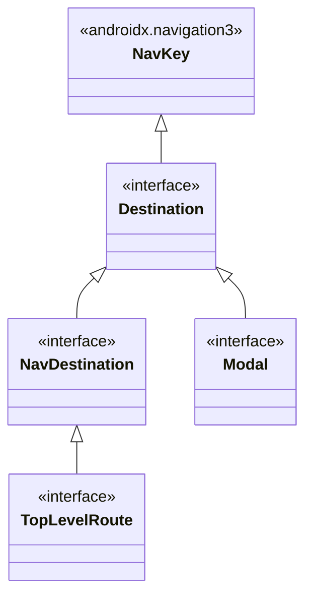

# Navigation Architecture & Router

This document defines the **Navigation Architecture** for the Kotlin Multiplatform (KMP) template, built on top of **Jetpack Navigation 3 (`androidx.navigation3`)** and the decoupled **`Router`** system.

---

## 1. Overview & Architecture

Navigation in the application is managed in a pure, platform-independent way in `shared/src/commonMain`. ViewModels and presenters navigate by calling methods on the injected [`Router`](file:///E:/Dev/AndroidStudioProjects/Finni/shared/src/commonMain/kotlin/com/hackathon/finni/core/ui/navigation/router/Router.kt) without direct coupling to `@Composable` scopes or Android `Context`.

```mermaid
graph TD
    subgraph VM Layer [ViewModel Layer]
        VM[ViewModel]
        Router[Router : Navigator, TabNavigator]
    end

    subgraph Nav State [Navigation State]
        State[(NavigationState: tabStacks, currentTab)]
        Channels[Result Channels]
    end

    subgraph UI Layer [UI Layer (Compose Multiplatform)]
        NavContainer[NavigationContainer]
        AppNavDisp[AppNavDisplay]
        NavDisp[NavDisplay (Base Stack)]
        Overlays[Overlay Layer (Modals / BottomSheets)]
        Screens[Composable Screens]
    end

    VM -->|push / pop / sendResult| Router
    Router -->|Updates| State
    Router -->|Sends / Receives| Channels
    State -.->|collectAsState| NavContainer
    NavContainer --> AppNavDisp
    AppNavDisp --> NavDisp
    AppNavDisp --> Overlays
    NavDisp --> Screens
    Overlays --> Screens
```

### Key Architectural Strengths:
1. **100% Platform-Agnostic**: ViewModels inject `Router` via Koin (`single { Router(initialTab = Splash) }`), enabling headless unit testing of navigation workflows.
2. **Multi-Stack Tab Support**: Each `TopLevelRoute` owns its own independent backstack that is preserved across tab switches.
3. **Dedicated Overlay Layer**: `Modal` destinations (dialogs, bottom sheets, full-screen image viewers) are rendered above the base `NavDisplay` with smooth exit animations via `ExitController`.
4. **Channel-Based Result Passing**: Screens can send and receive strongly typed results asynchronously with automatic cleanup when the caller is popped.
5. **Adaptive Scenes**: Native integration with Material 3 Adaptive layouts (`rememberListDetailSceneStrategy`, `rememberSupportingPaneSceneStrategy`).

---

## 2. Route Declaration (`Destination.kt` & `Destinations.kt`)

Located in: [`router/Destination.kt`](file:///E:/Dev/AndroidStudioProjects/Finni/shared/src/commonMain/kotlin/com/hackathon/finni/core/ui/navigation/router/Destination.kt) and [`Destinations.kt`](file:///E:/Dev/AndroidStudioProjects/Finni/shared/src/commonMain/kotlin/com/hackathon/finni/core/ui/navigation/Destinations.kt)

All navigation targets implement `Destination` (which extends `androidx.navigation3.runtime.NavKey`). Every destination must be `@Serializable`.



### Destination Hierarchy:

| Interface | Purpose | Examples |
| :--- | :--- | :--- |
| **`TopLevelRoute`** | Root tabs/screens that anchor independent backstacks. | `Splash`, `Home`, `Auth` |
| **`NavDestination`** | Standard full-screen routes pushed onto the stack. | `NoteEditor(val noteId: NoteId?)`, `ProjectEditor(val projectId: ProjectId)` |
| **`Modal`** | Dialogs, Bottom Sheets, and Overlays rendered above the screen stack. | `Confirmation(val title: String, val text: String?)`, `OverlayImages(val urls: List<String>, val initialIndex: Int)` |

#### Example Route Declarations:
```kotlin
@Serializable
data object Splash : TopLevelRoute

@Serializable
data object Home : TopLevelRoute

@Serializable
data object Auth : TopLevelRoute

@Serializable
data class NoteEditor(val noteId: NoteId? = null) : Destination

@Serializable
data class ProjectEditor(val projectId: ProjectId) : Destination

@Serializable
data class Confirmation(val title: String, val text: String? = null) : Modal

@Serializable
data class OverlayImages(val urls: List<String>, val initialIndex: Int) : Modal
```

---

## 3. Backstack Operations (`Router` & `NavigatorExt`)

Located in: [`Router.kt`](file:///E:/Dev/AndroidStudioProjects/Finni/shared/src/commonMain/kotlin/com/hackathon/finni/core/ui/navigation/router/Router.kt) and [`NavigatorExt.kt`](file:///E:/Dev/AndroidStudioProjects/Finni/shared/src/commonMain/kotlin/com/hackathon/finni/core/ui/navigation/router/NavigatorExt.kt)

All mutations to the backstack are pure transformations of `List<Destination>` applied atomically to `NavigationState`.

### 3.1. Standard Navigation Methods

| Extension Function | Description |
| :--- | :--- |
| **`router.push(destination)`** | Pushes a new screen onto the current tab's backstack. |
| **`router.pushNew(destination)`** | Pushes only if the screen is not already on top of the stack (prevents double-clicks). |
| **`router.pop()`** | Pops the topmost screen from the current stack. |
| **`router.popTo(index)`** | Pops all screens down to a specific index in the current stack. |
| **`router.popWhile { predicate }`** | Pops screens from the top while the condition holds true. |
| **`router.bringToFront(destination)`** | If the destination exists in the stack, moves it to the top; otherwise pushes it. |
| **`router.replaceCurrent(destination)`** | Replaces the top destination with a new one. |
| **`router.replaceAll(vararg destinations)`** | Clears the current stack and sets the given destinations. |

### 3.2. Multi-Tab Operations

- **`router.switchTab(tab: TopLevelRoute)`**: Switches active tab. If already on that tab, emits a scroll-to-top event via `router.scrollToTopEvent`.
- **`router.updateTabs { ... }`**: Transforms all tab stacks simultaneously.
- **Targeted tab operations**: `router.push(tabKlass, destination)`, `router.pop(tabKlass)`, etc.

#### ViewModel Usage Example:
```kotlin
class HomeViewModel(
    private val router: Router
) : ViewModel() {

    fun onNoteClick(noteId: NoteId) {
        router.push(NoteEditor(noteId))
    }

    fun onCreateNoteClick() {
        router.pushNew(NoteEditor(noteId = null))
    }

    fun onLogout() {
        router.replaceAll(Auth)
    }
}
```

---

## 4. Result Passing & Receiving (`NavigationResult`)

Located in: [`NavigationResult.kt`](file:///E:/Dev/AndroidStudioProjects/Finni/shared/src/commonMain/kotlin/com/hackathon/finni/core/ui/navigation/router/NavigationResult.kt)

The router provides a channel-based result passing mechanism between screens without global singletons or fragile shared flows.

### 4.1. Declaring Results
All results implement `sealed interface NavigationResult` and must be `@Serializable`:

```kotlin
sealed interface NavigationResult

@Serializable
data class Confirmed(val confirmed: Boolean) : NavigationResult

@Serializable
data class ContextSelectedResult(val context: NoteContext) : NavigationResult

@Serializable
data class TagsSelectedResult(val tagIds: Set<TagId>) : NavigationResult
```

### 4.2. Sending Results (Child Screen / Modal)

```kotlin
class ContextPickerViewModel(
    private val router: Router
) : ViewModel() {

    // Option 1: Send result while keeping screen open
    fun onContextClick(context: NoteContext) {
        router.sendResult(ContextSelectedResult(context))
    }

    // Option 2: Send result and immediately pop the screen
    fun onConfirmClick() {
        router.popWithResult(Confirmed(true))
    }
}
```

### 4.3. Receiving Results (Parent Screen / ViewModel)

Parent ViewModels call `suspend router.receiveResult<T>()`:

```kotlin
class HomeViewModel(
    private val router: Router
) : ViewModel() {

    fun onSelectContextClick() {
        _uiState.update { it.copy(activePicker = HomePicker.Context(it.filter.context)) }
        
        viewModelScope.launch {
            // Suspends until ContextSelectedResult is sent or picker is dismissed
            val result = router.receiveResult<ContextSelectedResult>()
            
            _uiState.update { it.copy(activePicker = null) }
            if (result != null) {
                _uiState.update { it.copy(filter = it.filter.copy(context = result.context)) }
                loadNotes(initial = true)
            }
        }
    }
}
```

> [!TIP]
> **Automatic Memory & Coroutine Cleanup**: If the target screen is dismissed (e.g. user taps Back or dismisses bottom sheet), `receiveResult` automatically terminates, returns `null`, and purges its channel from `resultChannels` to prevent leaks.

---

## 5. UI Integration (`AppNavDisplay.kt` & `NavigationUI.kt`)

Located in: [`AppNavDisplay.kt`](file:///E:/Dev/AndroidStudioProjects/Finni/shared/src/commonMain/kotlin/com/hackathon/finni/core/ui/navigation/AppNavDisplay.kt) and [`NavigationUI.kt`](file:///E:/Dev/AndroidStudioProjects/Finni/shared/src/commonMain/kotlin/com/hackathon/finni/core/ui/navigation/NavigationUI.kt)

### 5.1. Overlay & Base Stack Separation

`AppNavDisplay` automatically splits the backstack into:
1. **Base Backstack**: Contains all routes up to the last non-`Modal` destination, rendered via `NavDisplay`.
2. **Active Overlays**: Contains `Modal` routes (rendered on top of `NavDisplay` in a `Box`).
3. **`ExitController`**: Manages exit animations for bottom sheets and dialogs so they animate smoothly before being removed from the Compose tree.

```kotlin
@Composable
fun NavigationContainer(
    viewModel: MainViewModel = koinViewModel()
) {
    val navigationState by viewModel.navigationState.collectAsState()

    AppNavDisplay(
        backStack = navigationState.flattenedBackStack,
        onBack = viewModel::onBack
    )
}
```

### 5.2. Screen Registration (`entryProvider`)

Each destination is registered in `entryProvider` using Navigation 3's type-safe `entry<T>` builder:

```kotlin
@Composable
private fun AppNavDisplay(
    backStack: List<Destination>,
    onBack: () -> Unit
) {
    NavDisplay(
        backStack = backStack,
        onBack = onBack,
        sceneStrategies = listOf(
            SimpleOverlaySceneStrategy(),
            rememberListDetailSceneStrategy(),
            rememberSupportingPaneSceneStrategy()
        ),
        entryDecorators = listOf(
            rememberSaveableStateHolderNavEntryDecorator(),
            rememberViewModelStoreNavEntryDecorator()
        ),
        entryProvider = entryProvider {
            entry<Splash> {
                SplashScreen()
            }
            entry<Home> {
                HomeScreen()
            }
            entry<Auth> {
                AuthScreen()
            }
            entry<NoteEditor> { destination ->
                NoteEditorScreen(noteId = destination.noteId)
            }
            entry<Confirmation> { destination ->
                ConfirmationDialog(title = destination.title, text = destination.text)
            }
        }
    )
}
```

---

## 6. Anti-Patterns & Best Practices

### Best Practices
- ✅ **Inject `Router` via Koin**: Always inject `Router` into ViewModels to keep presentation logic testable and decoupled from Compose UI.
- ✅ **Use `pushNew` for buttons**: Use `pushNew(destination)` to prevent duplicate screen pushes when users rapidly tap navigation buttons.
- ✅ **Mark routes with `@Serializable`**: Ensures state restoration works across process recreation on Android and state restoration on Desktop/iOS.
- ✅ **Use `Modal` for transient dialogs/sheets**: Implement `Modal` on bottom sheets or confirmation dialogs so `AppNavDisplay` handles overlay rendering and exit animations properly.

### Anti-Patterns
- ❌ **Passing `NavController` or Android `Context` into ViewModels**: ViewModels must never hold references to Compose UI controllers.
- ❌ **Global mutable state for navigation results**: Avoid static singletons or global shared flows for returning data; use `router.sendResult` / `router.receiveResult`.
- ❌ **Manual stack manipulation with global lists**: Always perform navigation mutations via `Router` methods (`push`, `pop`, `switchTab`).
