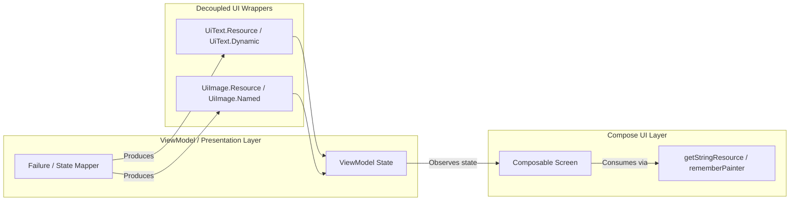

# Resources & Presentation UI Models Guide

This document defines the standards for working with **Compose Multiplatform Resources (`composeResources`)**, resource naming conventions, presentation wrappers (`UiText`, `UiImage`), and anti-patterns to avoid.

---

## 1. Compose Multiplatform Resources (`composeResources`)

The project uses Compose Multiplatform's built-in resource library (`org.jetbrains.compose.resources`) instead of platform-specific resources (Android `R.*`, iOS asset catalogs).

### Directory Structure

All resources reside in `shared/src/commonMain/composeResources/`:

```text
shared/src/commonMain/composeResources/
├── drawable/              # Vector drawables (XML/SVG) and raster images (PNG)
│   ├── ic_search.xml
│   ├── ic_lock_person.xml
│   └── ic_wifi_off.xml
├── values/                # Localized strings and plurals
│   ├── strings.xml        # Default (Russian/Base) strings
│   └── strings-en.xml     # (Optional) Language qualifiers
└── font/                  # Custom typography files (.ttf, .otf)
    ├── inter_regular.ttf
    └── inter_bold.ttf
```

### Generated Resource Accessor (`Res`)

The Gradle resource generator automatically produces the `Res` object in package `com.hackathon.finni.resources`:

```kotlin
import com.hackathon.finni.resources.Res
import com.hackathon.finni.resources.auth_title
import com.hackathon.finni.resources.ic_lock_person
import org.jetbrains.compose.resources.painterResource
import org.jetbrains.compose.resources.stringResource

// In Compose UI:
val title = stringResource(Res.string.auth_title)
val icon = painterResource(Res.drawable.ic_lock_person)
```

---

## 2. Resource Naming Conventions

Consistent naming makes resources discoverable and prevents collisions across features.

### 2.1. String Resources (`values/strings.xml`)

String keys follow a structured, hierarchical **snake_case** pattern:

```text
<scope>_<category/feature>_[<element>_]<type/role>
```

#### Segments Definition:

| Segment | Options / Pattern | Examples |
| :--- | :--- | :--- |
| **`<scope>`** | `common_`<br>`<feature>_` | `common_`, `auth_`, `user_`, `notes_`, `projects_` |
| **`<category>`** | `error_`<br>`nav_`<br>`action_`<br>`loading_`<br>`datetime_`<br>`<field>_` | `common_error_...`<br>`common_nav_notes`<br>`common_action_retry`, `auth_action_login`<br>`common_loading_long_msg`<br>`common_datetime_today`<br>`auth_email_...`, `auth_password_...` |
| **`<type/role>`** | `_title`<br>`_msg`<br>`_label`<br>`_placeholder`<br>`_error_<rule>` | `_error_no_connection_title`<br>`_error_no_connection_msg`<br>`_email_label`<br>`_email_placeholder`<br>`_email_error_empty`, `_password_error_short` |

#### Examples:
```xml
<!-- Common System Errors -->
<string name="common_error_no_connection_title">Проблемы со связью</string>
<string name="common_error_no_connection_msg">Проверьте интернет-соединение</string>
<string name="common_error_timeout_title">Время ожидания истекло</string>
<string name="common_error_timeout_msg">Сервер отвечает слишком долго</string>

<!-- Common Actions -->
<string name="common_action_retry">Повторить</string>
<string name="common_action_ok">ОК</string>
<string name="common_action_cancel">Отмена</string>

<!-- Feature Auth -->
<string name="auth_title">Авторизация</string>
<string name="auth_email_label">Email</string>
<string name="auth_email_placeholder">example@domain.com</string>
<string name="auth_email_error_empty">Введите адрес электронной почты</string>
<string name="auth_action_toggle_password_visibility">Переключить видимость пароля</string>
<string name="auth_action_login">Войти</string>
<string name="auth_error_credentials_msg">Неверный логин или пароль</string>
```

#### Punctuation Rules:
- **No trailing period** on titles, button labels, field labels, tooltips, or short single-sentence messages/errors.
- **Use periods** only when a message contains two or more complete sentences (e.g. `Внутренняя ошибка сервера. Попробуйте позже`).
- **Maintain Title / Message symmetry**: When creating errors, define both `_title` and `_msg` whenever a dialog or alert needs both headers and bodies.

---

### 2.2. Drawable & Icon Resources (`drawable/`)

Vector drawables and raster assets use strict prefix conventions:

| Type | Prefix | Format | Example |
| :--- | :--- | :--- | :--- |
| **Vector Icons** | `ic_` | `.xml` (Android Vector) or `.svg` | `ic_search.xml`, `ic_wifi_off.xml`, `ic_lock_person.xml` |
| **Illustrations / Images** | `img_` | `.png`, `.webp`, `.xml` | `img_empty_notes.png`, `img_welcome_banner.webp` |
| **Backgrounds / Shapes** | `bg_` | `.xml` | `bg_card_gradient.xml` |

> [!IMPORTANT]
> Always use pure lowercase `snake_case` for filenames. Never use uppercase letters, spaces, or hyphens in drawable names.

---

### 2.3. Font Resources (`font/`)

Font files use the naming standard: `<family>_<weight>.ttf`:
- `inter_regular.ttf`
- `inter_medium.ttf`
- `inter_bold.ttf`
- `roboto_medium.ttf`

---

## 3. Presentation Models: `UiText` and `UiImage`

To keep ViewModels, Domain mappers, and Error handlers **100% decoupled from the Compose Runtime and Android Context**, the project uses lightweight presentation wrappers.



---

### 3.1. `UiText`

Located in: [`com.hackathon.finni.core.presentation.model.UiText`](file:///E:/Dev/AndroidStudioProjects/Finni/shared/src/commonMain/kotlin/com/hackathon/finni/core/presentation/model/UiText.kt)

`UiText` represents a string that can be either localized (from `Res.string`), pluralized (from `Res.plurals`), or dynamic (runtime backend string):

```kotlin
sealed interface UiText {
    data class Dynamic(val value: String) : UiText

    data class Resource(
        val res: StringResource,
        val args: List<Any> = emptyList()
    ) : UiText {
        constructor(res: StringResource, vararg formatArgs: Any) : this(res, formatArgs.toList())
    }

    data class Plural(
        val res: PluralStringResource,
        val quantity: Int,
        val args: List<Any> = emptyList()
    ) : UiText {
        constructor(res: PluralStringResource, quantity: Int, vararg formatArgs: Any) : this(res, quantity, formatArgs.toList())
    }
}
```

#### Producing `UiText` in ViewModel / Error Mappers:
```kotlin
// 1. Static localized resource
val title = UiText.Resource(Res.string.common_error_no_connection_title)

// 2. Localized resource with format arguments
val welcome = UiText.Resource(Res.string.home_welcome_user, userName)

// 3. Dynamic server/runtime error message
val serverError = UiText.Dynamic("Server returned error code: 502")
```

#### Consuming `UiText` in Compose UI:
Extension functions located in [`uiText.kt`](file:///E:/Dev/AndroidStudioProjects/Finni/shared/src/commonMain/kotlin/com/hackathon/finni/core/ui/extension/uiText.kt):

```kotlin
// Inside Composable:
Text(text = uiState.errorMessage.getStringResource())

// Inside Coroutines / Non-composable functions:
val plainString = uiState.errorMessage.getString()
```

---

### 3.2. `UiImage` (Icon / Image Wrapper)

Located in: [`com.hackathon.finni.core.presentation.model.UiImage`](file:///E:/Dev/AndroidStudioProjects/Finni/shared/src/commonMain/kotlin/com/hackathon/finni/core/presentation/model/UiImage.kt)

`UiImage` abstracts drawable resources and dynamic image names:

```kotlin
sealed interface UiImage {
    data class Resource(val res: DrawableResource) : UiImage
    data class Named(val name: String) : UiImage
}
```

#### Producing `UiImage`:
```kotlin
// 1. Type-safe drawable
val errorIcon = UiImage.Resource(Res.drawable.ic_wifi_off)

// 2. Dynamic lookup by name (e.g. from backend response)
val categoryIcon = UiImage.Named("ic_tag")
```

#### Consuming `UiImage` in Compose UI:
Extension function located in [`uiIcon.kt`](file:///E:/Dev/AndroidStudioProjects/Finni/shared/src/commonMain/kotlin/com/hackathon/finni/core/ui/extension/uiIcon.kt):

```kotlin
@Composable
fun ErrorDialog(uiError: UiError) {
    Icon(
        painter = uiError.icon.rememberPainter(),
        contentDescription = null
    )
}
```

---

## 4. Anti-Patterns & Best Practices

### 4.1. ❌ DO NOT use `material-icons-extended`
The dependency `androidx.compose.material:material-icons-extended` is strictly forbidden in this project:
- **Why?** It contains over 10,000 generated icon classes, adding 15–20 MB to build artifacts, causing severe APK/binary bloat, and dramatically slowing down build times and IDE indexing.
- **Correct approach**: Download only the vector icons you need from Material Symbols / Icons, place the XML vector files into `shared/src/commonMain/composeResources/drawable/ic_<name>.xml`, and access them type-safely via `Res.drawable.ic_<name>`.

---

### 4.2. ❌ DO NOT leak Compose `@Composable` functions into ViewModels
Never call `stringResource(...)` or `painterResource(...)` inside a ViewModel, Repository, or UseCase:
- **Why?** ViewModels must remain pure Kotlin classes that can run in headless unit tests without initializing the Compose Snapshot system.
- **Correct approach**: ViewModels expose `UiText` or `UiImage`. The Composable screen calls `.getStringResource()` and `.rememberPainter()` at the boundary.

---

### 4.3. ❌ DO NOT hardcode user-facing strings
Never write raw string literals in UI or ViewModels for static labels or errors:
```kotlin
// ❌ WRONG: Hardcoded string
Text("Неверный логин или пароль")

// ✅ CORRECT: Localized string resource
Text(stringResource(Res.string.auth_error_credentials_msg))
```

---

### 4.4. ❌ DO NOT use `_title` strings as error messages
Ensure proper separation of concern between headers and body descriptions:
```kotlin
// ❌ WRONG: Using a title resource as an error message
is InvalidRequest -> UiText.Resource(Res.string.common_error_invalid_request_title)

// ✅ CORRECT: Use the dedicated message resource
is InvalidRequest -> UiText.Resource(Res.string.common_error_invalid_request_msg)
```

---

### 4.5. Summary Checklist for Adding New Resources

1. [ ] **Vector Icon**: Added as `ic_<name>.xml` in `composeResources/drawable/`.
2. [ ] **Strings**: Added to `values/strings.xml` following `<scope>_<category>_[<element>_]<type>` naming.
3. [ ] **Titles & Messages**: If adding a new error, added both `_title` and `_msg` if both are needed.
4. [ ] **ViewModel State**: Exposed as `UiText` / `UiImage` if produced in ViewModels or Mappers.
5. [ ] **Punctuation**: No trailing period on single-sentence errors/labels.
