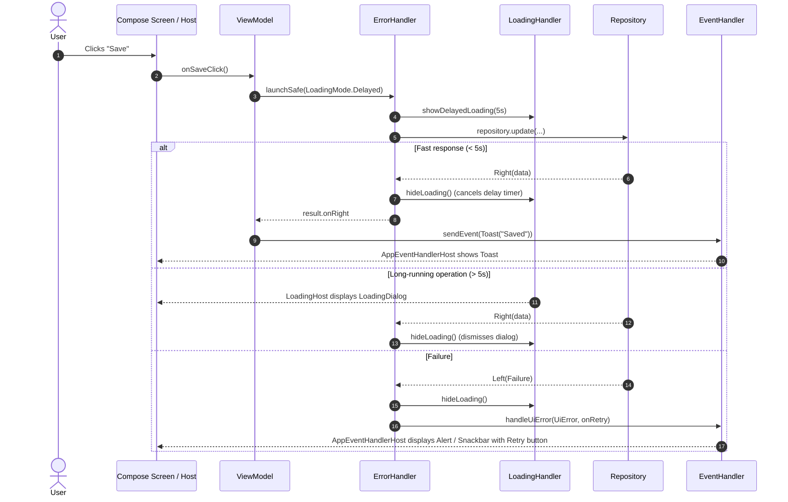

# ViewModel Delegates & State Handlers

This project adopts a **composition over inheritance** approach (`Composition over Inheritance`) instead of monolithic base classes (`BaseViewModel`).

---

## 1. Purpose & Architectural Concept

### Why Delegates?
1. **Single Responsibility Principle (SRP)**: Each delegate handles exactly one concern (error handling, loading indicator states, single UI events, or list refresh logic).
2. **Flexible Composition**: A ViewModel integrates only the capabilities it actually needs using Kotlin interface delegation (`by delegate`).
3. **Consistent UX**: Dialogs, snackbars, loading overlays, toast messages, and pull-to-refresh behaviors remain unified across all platforms (Android, Desktop, iOS).
4. **Testability**: Delegates can be easily isolated and mocked in unit tests.

### DI Registration (Koin)
Delegates are registered in `CoreModule.kt`:
- `EventHandler` — `singleOf(::EventHandler)` (global event bus for the app).
- `LoadingHandler` — `singleOf(::LoadingHandlerImpl)` (global loading dialog/overlay state).
- `ErrorHandler` — `singleOf(::ErrorHandlerImpl)` (error interception service connecting `EventHandler` and `LoadingHandler`).
- `RefreshHandler` — `factoryOf(::RefreshHandlerImpl)` (new instance created per screen/ViewModel).

---

## 2. Delegates Overview

| Delegate | Interface | Purpose |
| :--- | :--- | :--- |
| **[ErrorHandler](#3-errorhandler)** | `ErrorHandler` | Safe coroutine launching (`launchSafe`), error interception without manual `try-catch`, mapping `Failure` to `UiError`, integration with `LoadingHandler` and `EventHandler`. |
| **[RefreshHandler](#4-refreshhandler)** | `RefreshHandler` | Reactive data reloading (`bindToRefresh`), tracking `isRefreshing` and `isRetrying` flags for pull-to-refresh and retry actions. |
| **[LoadingHandler](#5-loadinghandler)** | `LoadingHandler` | Managing wait states (`LoadingState`): instant overlay, delayed dialog (5s delay), and snackbar progress. |
| **[EventHandler](#6-eventhandler)** | `EventHandler` | Single event / side-effect stream (`Channel<UIEvent>`): toasts, snackbars, and alert dialogs. |

---

## 3. ErrorHandler

### Purpose
Used to handle errors when performing **active user actions** (saving changes, deleting an item, searching, submitting forms, network requests).

> [!IMPORTANT]
> **All action errors must be handled via `ErrorHandler` without manual `try-catch` blocks!**

### How It Works
- Provides `launchSafe(...)` with `context(viewModel: ViewModel)`.
- Executes the provided `suspend () -> RequestResult<*>` block.
- Automatically manages loading indicators via `LoadingMode` (`None`, `Instant`, `Delayed`).
- On failure (`Failure`):
  1. Converts `Failure` into `UiError` (using an optional `failureMapper`).
  2. Evaluates the local handler `handler?.invoke(uiError)`.
  3. If unhandled locally, dispatches the error globally via `eventHandler.handleUiError(uiError, onRetry = { ... })`.

```kotlin
interface ErrorHandler {
    context(viewModel: ViewModel)
    fun launchSafe(
        loadingMode: LoadingMode = LoadingMode.Delayed(),
        failureMapper: ((Failure) -> UiError?)? = null,
        handler: (suspend (UiError) -> Boolean)? = null,
        block: suspend () -> RequestResult<*>
    ): Job
}
```

### Usage Example
File: [`NoteEditorViewModel.kt`](file:///E:/Dev/AndroidStudioProjects/Finni/shared/src/commonMain/kotlin/com/hackathon/finni/features/noteeditor/NoteEditorViewModel.kt)

```kotlin
class NoteEditorViewModel(
    private val noteId: NoteId?,
    private val eventHandler: EventHandler,
    private val errorHandler: ErrorHandler,
    private val loadingHandler: LoadingHandler,
    private val noteRepository: NoteRepository
) : ViewModel(), 
    ErrorHandler by errorHandler, 
    LoadingHandler by loadingHandler {

    // 1. Background initial data load without loader (local skeleton UI)
    private fun loadNote(id: NoteId) {
        launchSafe(loadingMode = LoadingMode.None) {
            val result = noteRepository.findById(id)
            result.getOrNull()?.let { note ->
                _originalNote.value = note
                _draft.value = note.toDraft()
            }
            _isLoading.value = false
            result.toEitherLeftBiased()
        }
    }

    // 2. Saving data with delayed loading dialog
    fun onSaveClick(onSuccess: () -> Unit) {
        val draft = _draft.value
        val projectId = draft.projectId ?: return

        launchSafe(loadingMode = LoadingMode.Delayed()) {
            val result = if (noteId == null) {
                noteRepository.add(CreateNote(...))
            } else {
                noteRepository.update(noteId, UpdateNote(...))
            }

            result.onRight {
                eventHandler.sendEvent(UIEvent.Toast(UiText.Dynamic("Note saved")))
                onSuccess()
            }
        }
    }
}
```

### Best Practices
- ✅ Wrap all asynchronous user actions in `launchSafe`.
- ✅ Return `RequestResult<*>` directly from repositories or convert via `.toEitherLeftBiased()`.
- ✅ Use `failureMapper` only when a specific screen requires custom copy/icon for standard failures.
- ✅ Pass a local `handler` lambda when an error must be rendered inline within form fields instead of global alert/snackbar.

### Anti-patterns
- ❌ **Writing manual `try-catch` blocks**:
  ```kotlin
  // BAD:
  viewModelScope.launch {
      try {
          repository.save(data)
      } catch (e: Exception) {
          _errorState.value = e.message
      }
  }
  ```
- ❌ **Storing action error messages in `UiState`**: Avoid fields like `val errorMessage: String?` in `UiState` for network/server errors — `ErrorHandler` dispatches dialogs or snackbars automatically via `EventHandler`.

---

## 4. RefreshHandler

### Purpose
Used to coordinate **refreshing primary screen data** (lists, tables, dashboards) for:
1. Initial screen load.
2. User **Pull-to-Refresh** gestures.
3. **Retry** actions upon failure to load screen content.

### How It Works
- The `Flow<T>.bindToRefresh()` extension operator connects a data stream to refresh triggers (`Initial`, `PullToRefresh`, `Retry`).
- When a trigger fires, `bindToRefresh()` restarts the upstream flow using `flatMapLatest`.
- `isRefreshing` and `isRetrying` state flags automatically reset to `false` when data is emitted or when an error occurs.

```kotlin
interface RefreshHandler {
    val isRefreshing: StateFlow<Boolean>
    val isRetrying: StateFlow<Boolean>

    fun onRefresh()
    fun onRetry()
    fun <T> Flow<T>.bindToRefresh(): Flow<T>
}
```

### Usage Example
File: [`HomeViewModel.kt`](file:///E:/Dev/AndroidStudioProjects/Finni/shared/src/commonMain/kotlin/com/hackathon/finni/features/home/HomeViewModel.kt)

```kotlin
class HomeViewModel(
    private val router: Router,
    private val errorHandler: ErrorHandler,
    private val refreshHandler: RefreshHandler,
    private val noteRepository: NoteRepository
) : ViewModel(), 
    ErrorHandler by errorHandler, 
    RefreshHandler by refreshHandler {

    private val _uiState = MutableStateFlow(HomeUiState(isLoading = true))
    val uiState: StateFlow<HomeUiState> = _uiState.asStateFlow()

    private val _paginator = MutableStateFlow(noteRepository.findPaged(_uiState.value.filter))
    val paginator: StateFlow<Paginator<NoteResponse>> = _paginator.asStateFlow()

    init {
        // Reactive UI state: bindToRefresh() re-triggers the stream on onRefresh/onRetry
        _paginator
            .flatMapLatest { it.uiState }
            .bindToRefresh()
            .onEach { pState ->
                val allNotes = (pState as? PaginatorUIState.Content<NoteResponse>)?.items ?: emptyList()
                val isPaginatorLoading = pState is PaginatorUIState.Loading ||
                        (pState as? PaginatorUIState.Content<*>)?.appendState is PageState.Loading

                _uiState.update { current ->
                    current.copy(
                        notes = allNotes,
                        pinnedNotes = allNotes.filter { it.isPinned },
                        otherNotes = allNotes.filter { !it.isPinned },
                        isLoading = isPaginatorLoading
                    )
                }
            }
            .launchIn(viewModelScope)

        loadNotes(initial = true)
    }

    override fun onRefresh() {
        refreshHandler.onRefresh()
        loadNotes(initial = true)
    }

    override fun onRetry() {
        refreshHandler.onRetry()
        loadNotes(initial = true)
    }
}
```

### Best Practices
- ✅ Register `RefreshHandler` as `factoryOf(::RefreshHandlerImpl)` in DI to ensure each screen has an isolated refresh lifecycle.
- ✅ Apply `.bindToRefresh()` in `combine` or `flatMapLatest` pipelines when producing `uiState`.
- ✅ Forward Compose Pull-to-Refresh UI events directly to `viewModel.onRefresh()`.

### Anti-patterns
- ❌ **Manual flag toggling**: Creating `val isRefreshing = MutableStateFlow(false)` and setting `true/false` manually via `try-finally`.
- ❌ **Uncoordinated parallel jobs**: Spawning new coroutines on refresh without canceling ongoing fetch jobs (instead of leveraging `bindToRefresh`).

---

## 5. LoadingHandler

### Purpose
Used to display **progress and wait indicators for medium-to-long operations** (saving, syncing, file uploads/imports) that require UI blocking or progress visualization.

### How It Works & ErrorHandler Integration
`LoadingHandler` offers three distinct states (`LoadingState`):
1. **`LoadingState.Overlay`**: Instant semi-transparent fullscreen overlay blocking click events with a center spinner.
2. **`LoadingState.Dialog`**: Modal Material 3 dialog with title, optional subtitle, determinate/indeterminate progress (`0.0f..1.0f`), and optional cancel action.
3. **`LoadingState.Snackbar`**: Non-blocking bottom snackbar with progress indicator.

#### Seamless Integration with `ErrorHandler`:
Calling `launchSafe(loadingMode = ...)` manages `LoadingHandler` automatically:
- `LoadingMode.Delayed(state)`: Starts a 5-second timer (`delay(5.seconds)`). Fast operations (< 5s) complete without displaying a dialog, eliminating UI flicker. If delayed, the dialog appears smoothly.
- `LoadingMode.Instant(state)`: Shows the overlay/dialog immediately.
- `LoadingMode.None`: No loader is shown.
- When `block()` finishes, `ErrorHandler` guarantees calling `loadingHandler.hideLoading()`.

```kotlin
interface LoadingHandler {
    val loading: StateFlow<LoadingState?>
    fun showLoading(state: LoadingState = LoadingState.Overlay)
    fun showDelayedLoading(coroutineScope: CoroutineScope, state: LoadingState = LoadingState.Dialog(...))
    fun hideLoading()
}
```

### UI Host
In Compose, [`LoadingHost`](file:///E:/Dev/AndroidStudioProjects/Finni/shared/src/commonMain/kotlin/com/hackathon/finni/core/ui/components/AppLoadingHost.kt) collects `LoadingHandler.loading` and renders the corresponding UI indicator.

### Usage Example
File: [`NoteEditorViewModel.kt`](file:///E:/Dev/AndroidStudioProjects/Finni/shared/src/commonMain/kotlin/com/hackathon/finni/features/noteeditor/NoteEditorViewModel.kt)

```kotlin
fun onSaveClick(onSuccess: () -> Unit) {
    val draft = _draft.value
    val projectId = draft.projectId ?: return

    // LoadingMode.Delayed() connects LoadingHandler automatically
    // showing the dialog only if response takes longer than 5 seconds
    launchSafe(loadingMode = LoadingMode.Delayed()) {
        val result = noteRepository.update(noteId, UpdateNote(...))
        result.onRight { onSuccess() }
    }
}
```

### Best Practices
- ✅ Prefer `LoadingMode.Delayed()` for mutations (save, update) to avoid flickering loaders on fast networks.
- ✅ Use `LoadingMode.Instant()` when immediate input blocking is required to prevent double-tap submissions.
- ✅ Use `LoadingMode.None` when screen has its own inline progress indicator or skeleton placeholder.

### Anti-patterns
- ❌ **Showing blocking dialogs for fast GET queries**: Results in distracting micro-flashes of UI dialogs.
- ❌ **Missing `hideLoading()`**: When using `LoadingHandler` manually (outside `launchSafe`), always call `hideLoading()` inside a `finally` block.

---

## 6. EventHandler

### Purpose
Used to deliver **single UI events and side-effects** that must not be stored in `UiState`:
- **Toast** messages.
- **Snackbar** notifications with action callbacks.
- **AlertMessage** confirmation and warning dialogs.

### How It Works & ErrorHandler Integration
- Internally backed by a buffered channel `Channel<UIEvent>(Channel.BUFFERED)` exposed as `Flow<UIEvent>`.
- The [`AppEventHandlerHost`](file:///E:/Dev/AndroidStudioProjects/Finni/shared/src/commonMain/kotlin/com/hackathon/finni/core/ui/components/AppEventHost.kt) Composable collects events and renders Material 3 elements.

#### Integration with `ErrorHandler`:
Unhandled failures in `ErrorHandler.launchSafe` trigger:
```kotlin
eventHandler.handleUiError(
    uiError = uiError,
    onRetry = { launchSafe(...) }
)
```
`EventHandler.handleUiError` converts `UiError` into:
- `UIEvent.AlertMessage` — when user confirmation or retry action is needed.
- `UIEvent.Action` with login navigation — when `UnauthorizedError` occurs.
- `UIEvent.Snackbar` — when error is configured with `ActionErrorDisplayType.Snackbar`.

```kotlin
sealed interface UIEvent {
    data class AlertMessage(
        val title: UiText,
        val text: UiText? = null,
        val icon: UiImage? = null,
        val confirmAction: Action = Action.DEFAULT_CONFIRM_ACTION,
        val dismissAction: Action? = ...
    ) : UIEvent

    data class Action(val label: UiText, val onClick: () -> Unit)
    data class Toast(val message: UiText, val duration: ToastDuration = ToastDuration.SHORT) : UIEvent
    data class Snackbar(val message: UiText, val action: Action? = null) : UIEvent
}
```

### Usage Example
```kotlin
// 1. Dispatching a toast:
eventHandler.sendEvent(UIEvent.Toast(UiText.Dynamic("Note saved successfully")))

// 2. Dispatching a confirmation alert dialog:
eventHandler.sendEvent(
    UIEvent.AlertMessage(
        title = UiText.Resource(Res.string.delete_title),
        text = UiText.Resource(Res.string.delete_confirmation_message),
        confirmAction = UIEvent.Action(UiText.Resource(Res.string.common_delete)) {
            deleteNote(id)
        }
    )
)
```

### Best Practices
- ✅ Dispatch all one-off side-effects through `eventHandler.sendEvent(...)`.
- ✅ Wrap text strings in `UiText` (`UiText.Resource` or `UiText.Dynamic`) for multiplatform localization without Android/JVM context.
- ✅ Supply an `onRetry` lambda to `handleUiError` whenever the failed action is idempotent and retryable.

### Anti-patterns
- ❌ **Persisting events in `UiState`**:
  ```kotlin
  // BAD:
  data class ScreenUiState(
      val showSuccessToast: Boolean = false, // Re-triggers on configuration changes!
      val toastMessage: String? = null
  )
  ```
- ❌ **Using unbuffered `SharedFlow(replay = 0)`**: Events might be dropped if the UI collector is not yet active. `Channel` ensures guaranteed one-time delivery.

---

## 7. Interaction Lifecycle Diagram


