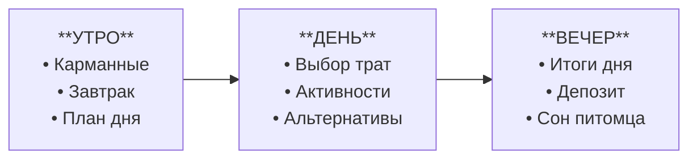
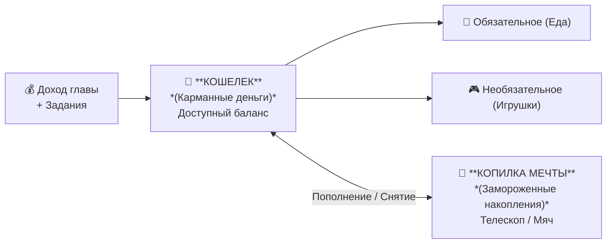

# Спецификация игрового дизайна: Виртуальный питомец и финансовые механики

> 🧭 **Навигация по документации:**
> - 📄 [Техническое задание (ТЗ)](TZ.md) — требования хакатона и критерии оценки
> - 🗺️ [Сюжетные главы и финансовые уровни](levels.md) — 6 глав, баланс монет и шаги сценария
> - 🎮 [Спецификация заданий и шаблонов](tasks.md) — 4 UI-шаблона (`DILEMMA`, `SMART_SHOP`,
    `CARD_SORTING`, `BUDGET_SPLIT`)
> - 🏛️ [Архитектурные стандарты проекта (AGENTS.md)](../../AGENTS.md) | [docs/core/](../core/)

## 1. Базовые принципы и этические рамки (Guardrails)

Главный педагогический посыл: **деньги — это инструмент заботы и достижения целей, а не источник страха**.

* **Запрет на запугивание и наказание:**
  * Питомец **не может умереть, тяжело заболеть, получить травму или сбежать из дома** из-за финансовых ошибок игрока.
  * Запрещены медицинские атрибуты (капельницы, уколы, больничные палаты) и агрессивные визуальные маркеры страданий.
  * Допустимы только обратимые и комичные реакции: зевота, урчание в животе, чесание за ухом, легкая задумчивость или сонливость.
* **Защита от тревоги при оффлайне:**
  * Пропуск реальных дней **не наказывается**. Прогресс не сгорает, здоровье не уходит в минус.
  * При возвращении в игру после перерыва питомец встречает ребенка бодрым и отдохнувшим: *«Привет! Я отлично выспался, давай начнем новый день!»*.
* **Всегда есть выход из кризиса:**
  * Игра не может зайти в безвыходный тупик (soft-lock). Даже при балансе в 0 монет и пустом холодильнике у ребенка есть доступные действия без финансовых затрат.

---

## 2. Игровой цикл и структура периодов

Вместо непрерывного микроменеджмента используется **дискретный управляемый день**, разделенный на 3 фазы. Ребенок сам переключает фазы действиями.

### Фаза 1. Утро (Планирование и обязательства)
1. В начале новой главы начисляется базовый доход (стартовый бюджет главы). В остальные дни доход формируется за счет выполнения сюжетных заданий.
2. Питомец просыпается с легким чувством голода.
3. Доступен магазин еды. Ребенок закрывает базовую потребность (завтрак).

### Фаза 2. День (Действия, заработок и искушения)
1. Питомец сыт и полон сил для активностей.
2. Ребенок решает:
   * Пройти мини-игру или решить викторину для заработка дополнительных монет.
   * Купить эмоциональный предмет (одежда, игрушка, наклейка).
   * Отправить монеты в «Копилку мечты».
3. Каждая активность расходует солнечный жетон (Время суток).

### Фаза 3. Вечер (Рефлексия и сон)

1. Когда солнечные жетоны дня исчерпаны (или ребенок решил закончить день), появляется экран *
   *«Итоги дня»**.
2. Визуальная диаграмма показывает структуру трат: *«Обязательное (еда) / Развлечения (игрушки) / Сбережения (копилка)»*.
3. Если в кошельке остались свободные монеты, система предлагает сделать вклад в копилку под процент.
4. Ребенок нажимает кнопку **«Уложить питомца спать»**.
5. Наступает ночь (колыбельная анимация), сессия безопасно завершается.

---

## 3. Показатели питомца (Метрики состояния)

### 1. Сытость (`Hunger`: 0 .. 100)

* **Назначение:** Экономический якорь регулярных обязательных расходов («Надо»).
* **Расход:** Дискретный. Падает каждое Утро на 40 пунктов.
* **При 0 сытости:** Питомец отказывается бегать и играть: *«В животе урчит, сил на веселье нет!»*.
  Активные сюжетные задания блокируются до приема пищи.

### 2. Настроение (`Mood`: `Sad`, `Neutral`, `Happy`)

* **Назначение:** Экономический якорь необязательных расходов («Хочу») и эмоциональный отклик на
  финансовые решения.
* **Градация:** 3 дискретных состояния (без сложных таймеров и непрерывных расчетов):
    * 😢 **Грустный / Озадаченный (`Sad`):** питомец голоден утром, не хватило монет на покупку или
      ребенок ошибся в дилемме (например, слил монеты в автомат).
    * 😐 **Спокойный / Нормальный (`Neutral`):** сыт, готов к делам (базовое утреннее состояние).
    * 😊 **Счастливый / Радостный (`Happy`):** куплена игрушка/декор, пополнена «Копилка мечты» или
      достигнута большая цель.
* **Защита от тревоги:** При наступлении ночи и утреннем пробуждении настроение всегда мягко
  возвращается в `Neutral` — оффлайн не наказывает ребенка.

### 3. Время суток / Солнечные жетоны (`TimeOfDay`: 3 жетона на день)

* **Назначение:** Естественный ограничитель экранного времени и темпа дневных активностей вместо
  непрерывной шкалы энергии.
* **Механика:** Каждый день ребенку доступны 3 солнечных жетона:
    * ☀️ **Утро:** планирование бюджета, завтрак.
    * ⛅ **День:** выполнение заданий, поход в магазин, активности (каждое крупное действие тратит 1
      жетон).
    * 🌙 **Вечер:** жетоны исчерпаны, экран итогов дня, вклад свободного остатка в копилку и сон.
* **Восстановление:** Сон питомца при завершении дня восстанавливает все 3 солнечных жетона на
  следующее утро.

---

## 4. Разрешение тупиковых ситуаций (Кейс: 0 монет, 0 еды, 0 жетонов времени)

Если ребенок потратил все деньги на безделушки и остался без еды и времени дня, система предлагает
три сценария выхода:

1. **Естественный сон (Основной путь):**
   * Уложить питомца в кровать можно при любых показателях абсолютно бесплатно.
   * Наступает следующий день: время суток сбрасывается на Утро (3 жетона). При переходе к новой
     главе начисляется базовый доход, и ребенок получает возможность спланировать бюджет заново.
2. **«Аварийная полка» на кухне:**
   * В холодильнике всегда бесплатно доступна простая овсяная каша или вода.
   * Она скучная, не дает праздничных эффектов, но поднимает сытость до минимальной нормы, достаточной для разблокировки действий.
3. **Гаражная распродажа (Комиссионка):**
    * Продажа купленных ранее аксессуаров из сундука за 40% начальной стоимости (действие не требует
      жетонов времени и сразу дает монеты на еду).

---

## 5. Экономический баланс и система счетов

Вся экономика построена на **двухконтурной системе счетов**, строго соответствующей ТЗ (п. 2.5.3,
2.5.5, 2.5.7):

### 1. Два счёта пользователя

1. **Кошелек (Карманные деньги / Доступный баланс):**
    * Единственный операционный счет на руках у ребенка.
    * С него оплачиваются все повседневные покупки: и обязательные (еда/уход), и эмоциональные (
      игрушки, наклейки).
    * Пополняется стартовым доходом в начале главы и наградами за выполнение заданий (+20..+40
      монет).
2. **Копилка мечты (Целевые сбережения):**
    * Сюда ребенок переводит свободные монеты из кошелька ради конкретной выбранной цели.
    * Монеты здесь **заморожены** от случайных трат. Снятие возможно только с отдельным
      предупреждением о потере прогресса (ТЗ п. 2.5.7).
    * **Пассивный доход:** +5% на баланс копилки каждые 3 завершенных игровых дня без снятий.

### 2. Как работает концепция «Подушки безопасности» без третьего счета

* Отдельный третий счет («Резерв») исключен, чтобы не перегружать интерфейс и ребенка 7–11 лет.
* **Педагогический урок:** Подушка безопасности — это **свободный запас монет, который ребенок
  осознанно оставляет в Кошельке**, а не спускает под ноль на мелкие хотелки.
* **Форс-мажорная проверка (Глава 5, Задание №11):** Если у ребенка есть запас в кошельке, он
  оплачивает непредвиденную трату (новый рюкзак) безболезненно. Если ребенок потратил всё на
  сладости — ему приходится вскрывать Копилку мечты, что наглядно отдаляет покупку Телескопа на
  несколько дней.

---

## 6. Механика накоплений («Копилка мечты»)

* **Визуализация:** Выбранная цель (Телескоп, Набор художника, Мяч) отображается полупрозрачным
  силуэтом в комнате питомца.
* **Прогресс:** Каждая отправленная в копилку монета визуально окрашивает предмет снизу вверх.
* **Защита цели:** Деньги из копилки нельзя потратить на повседневные снеки случайно. При попытке
  снятия появляется предупреждающее окно: *«Если забрать монеты, Телескоп отдалится на 2 дня! Точно
  забрать?»* (требование ТЗ п. 2.5.7).

---

## 7. Раздел для взрослого (Родительский контроль и баланс экранного времени)

Раздел предназначен для поддержки ребенка, мягкого контроля экранного времени и мониторинга
образовательного прогресса в соответствии с
требованиями [ТЗ (п. 2.5.12)](TZ.md#2512-раздел-для-взрослого).

### 1. Защитный барьер (Parent Gate)
Вход в родительский раздел защищен от случайного или намеренного нажатия ребенком:
* Решение математического примера (например, `7 × 8 = ?` или `23 + 18 = ?`) или удержание специальной кнопки в течение 3 секунд.

### 2. Ограничение темпа игры (Лимит глав в день)
Чтобы сформировать здоровую привычку, защитить ребенка от залипания в телефоне и приучить к регулярности:
* **Настройка лимита:** Родитель выбирает допустимое количество пройденных глав (игровых дней) за одни реальные календарные сутки:
  * `1 глава в день` *(рекомендуемый режим по умолчанию — 15–20 минут осознанной игры)*;
  * `2 главы в день`;
  * `3 главы в день`;
  * `Без ограничений`.
* **Поведение при исчерпании лимита:**
  * После завершения последней разрешенной на сегодня главы и экрана «Итоги дня» питомец сладко засыпает в кроватке до следующего календарного дня.
  * Появляется теплое сообщение: *«Финни отлично потрудился сегодня и набрался впечатлений. Теперь он крепко спит до завтра! Отдохни и ты, увидимся завтра утром!»*.
  * Новые траты и активности блокируются до наступления следующих суток (или снятия лимита родителем). Доступен только пассивный осмотр комнаты и статуса накоплений.

### 3. Демонстрационный режим (Для экспертной проверки)
* В родительском меню размещен переключатель **«Демонстрационный режим»**:
    * Снимает суточный лимит и позволяет экспертам пройти все 6 глав подряд без ожидания реального
      времени (требование [ТЗ п. 2.5.13](TZ.md#2513-сохранение-состояния-и-демонстрационный-режим)).
  * Содержит кнопку **«Сбросить тестовый профиль»** для повторного запуска обязательного демонстрационного сценария с нуля.

### 4. Педагогическая аналитика и поощрение
* **Экран прогресса:** Наглядная сводка без оценочных суждений — какие финансовые темы пройдены (бюджет, сбережения, форс-мажоры), сколько отложено в «Копилку мечты», какова структура трат ребенка (доля обязательных vs импульсивных покупок).
* **Родительский бонус:** Возможность начислить небольшую сумму игровых монет (например, +20..+50) за реальные успехи ребенка в жизни (помощь по дому, чтение книги) с текстовой похвалой от родителя.