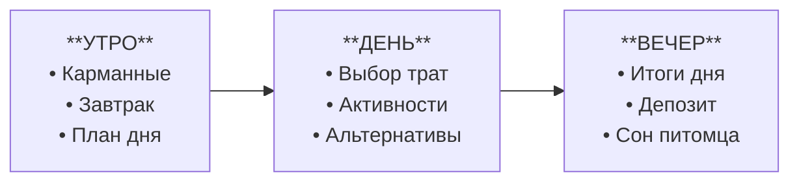

# Спецификация игрового дизайна: Виртуальный питомец и финансовые механики

## 1. Базовые принципы и этические рамки (Guardrails)

Главный педагогический посыл: **деньги — это инструмент заботы и достижения целей, а не источник страха**.

* **Запрет на запугивание и наказание:**
  * Питомец **не может умереть, тяжело заболеть, получить травму или сбежать из дома** из-за финансовых ошибок игрока.
  * Запрещены медицинские атрибуты (капельницы, уколы, больничные палаты) и агрессивные визуальные маркеры страданий.
  * Допустимы только обратимые и комичные реакции: зевота, урчание в животе, чесание за ухом, легкая задумчивость или сонливость.
* **Защита от тревоги при оффлайне:**
  * Пропуск реальных дней **не наказывается**. Прогресс не сгорает, здоровье не уходит в минус.
  * При возвращении в игру после перерыва питомец встречает ребенка бодрым и отдохнувшим: *«Привет! Я отлично выспался, давай начнем новый день!»*.
* **Всегда есть выход из кризиса:**
  * Игра не может зайти в безвыходный тупик (soft-lock). Даже при балансе в 0 монет и пустом холодильнике у ребенка есть доступные действия без финансовых затрат.

---

## 2. Игровой цикл и структура периодов

Вместо непрерывного микроменеджмента используется **дискретный управляемый день**, разделенный на 3 фазы. Ребенок сам переключает фазы действиями.

### Фаза 1. Утро (Планирование и обязательства)
1. В начале новой главы начисляется базовый доход (стартовый бюджет главы). В остальные дни доход формируется за счет выполнения сюжетных заданий.
2. Питомец просыпается с легким чувством голода.
3. Доступен магазин еды. Ребенок закрывает базовую потребность (завтрак).

### Фаза 2. День (Действия, заработок и искушения)
1. Питомец сыт и полон сил для активностей.
2. Ребенок решает:
   * Пройти мини-игру или решить викторину для заработка дополнительных монет.
   * Купить эмоциональный предмет (одежда, игрушка, наклейка).
   * Отправить монеты в «Копилку мечты».
3. Активные действия тратят шкалу Энергии.

### Фаза 3. Вечер (Рефлексия и сон)
1. Когда шкала Энергии опустошена (или ребенок решил закончить день), появляется экран **«Итоги дня»**.
2. Визуальная диаграмма показывает структуру трат: *«Обязательное (еда) / Развлечения (игрушки) / Сбережения (копилка)»*.
3. Если в кошельке остались свободные монеты, система предлагает сделать вклад в копилку под процент.
4. Ребенок нажимает кнопку **«Уложить питомца спать»**.
5. Наступает ночь (колыбельная анимация), сессия безопасно завершается.

---

## 3. Показатели питомца (Метрики состояния)

### 1. Сытость (`Hunger`: 0 .. 100)
* **Назначение:** Экономический якорь регулярных обязательных расходов.
* **Расход:** Дискретный. Падает каждое Утро на 40 пунктов.
* **При 0 сытости:** Питомец отказывается бегать и играть: *«В животе урчит, сил на веселье нет!»*. Активные мини-игры блокируются до приема пищи.

### 2. Энергия (`Energy`: 0 .. 100)
* **Назначение:** Естественный ограничитель экранного времени и балансировщик дневной активности.
* **Расход:**
  * Физические мини-игры и работа: -30..-40% за сессию.
  * Пассивное взаимодействие (погладить, осмотреть комнату): 0%.
* **Восстановление:** Сон питомца при завершении игрового дня (восстанавливает до 100%).

---

## 4. Разрешение тупиковых ситуаций (Кейс: 0 монет, 0 еды, 0 энергии)

Если ребенок потратил все деньги на безделушки и остался без еды и энергии, система предлагает три сценария выхода:

1. **Естественный сон (Основной путь):**
   * Уложить питомца в кровать можно при любых показателях абсолютно бесплатно.
   * Наступает следующий день: энергия восстанавливается до максимума. При переходе к новой главе начисляется базовый доход, и ребенок получает возможность спланировать бюджет заново.
2. **«Аварийная полка» на кухне:**
   * В холодильнике всегда бесплатно доступна простая овсяная каша или вода.
   * Она скучная, не дает праздничных эффектов, но поднимает сытость до минимальной нормы, достаточной для разблокировки действий.
3. **Гаражная распродажа (Комиссионка):**
   * Продажа купленных ранее аксессуаров из сундука за 40% начальной стоимости (действие требует 0 энергии и сразу дает монеты на еду).

---

## 5. Экономический баланс и типы денег

### Источники поступления валюты
1. **Базовый доход главы:** начисляется в начале каждой новой главы как стартовый бюджет (гарантированный капитал на период).
2. **Интеллектуальный труд:** +20..+40 монет за выполнение сюжетных заданий и задачек на счет внутри главы.
3. **Пассивный доход (Проценты):** +5% на баланс копилки каждые 3 завершенных игровых цикла без снятий.

### Матрица распределения дневного бюджета (на базе 100 монет дохода)

| Категория | Стоимость | Доля дохода | Влияние на игру |
| :--- | :--- | :--- | :--- |
| **Базовая еда (Яблоко/Каша)** | 35–40 | ~35–40% | Закрывает голод, переводит питомца в бодрый статус |
| **Премиум-еда (Капкейк/Пицца)** | 80 | ~80% | Сытость + праздничная анимация, но сжигает почти весь бюджет |
| **Мелкая хотелка (Стикер/Мяч)** | 30–50 | ~30–50% | Мгновенная анимация радости, конкурирует со сбережениями |
| **Большая цель (Скейтборд/Домик)** | 400–800 | Накопления | Требует откладывать свободный остаток 4–8 дней подряд |

---

## 6. Механика накоплений («Копилка мечты»)

* **Визуализация:** Выбранная цель отображается полупрозрачным силуэтом в комнате питомца.
* **Прогресс:** Каждая отправленная в копилку монета визуально окрашивает предмет снизу вверх.
* **Заморозка:** Деньги из копилки нельзя потратить на повседневные снеки случайно (требуется подтверждение разбития копилки с потерей накопленных бонусных процентов).

---

## 7. Раздел для взрослого (Родительский контроль и баланс экранного времени)

Раздел предназначен для поддержки ребенка, мягкого контроля экранного времени и мониторинга образовательного прогресса в соответствии с требованиями ТЗ (п. 2.5.12).

### 1. Защитный барьер (Parent Gate)
Вход в родительский раздел защищен от случайного или намеренного нажатия ребенком:
* Решение математического примера (например, `7 × 8 = ?` или `23 + 18 = ?`) или удержание специальной кнопки в течение 3 секунд.

### 2. Ограничение темпа игры (Лимит глав в день)
Чтобы сформировать здоровую привычку, защитить ребенка от залипания в телефоне и приучить к регулярности:
* **Настройка лимита:** Родитель выбирает допустимое количество пройденных глав (игровых дней) за одни реальные календарные сутки:
  * `1 глава в день` *(рекомендуемый режим по умолчанию — 15–20 минут осознанной игры)*;
  * `2 главы в день`;
  * `3 главы в день`;
  * `Без ограничений`.
* **Поведение при исчерпании лимита:**
  * После завершения последней разрешенной на сегодня главы и экрана «Итоги дня» питомец сладко засыпает в кроватке до следующего календарного дня.
  * Появляется теплое сообщение: *«Финни отлично потрудился сегодня и набрался впечатлений. Теперь он крепко спит до завтра! Отдохни и ты, увидимся завтра утром!»*.
  * Новые траты и активности блокируются до наступления следующих суток (или снятия лимита родителем). Доступен только пассивный осмотр комнаты и статуса накоплений.

### 3. Демонстрационный режим (Для экспертной проверки)
* В родительском меню размещен переключатель **«Демонстрационный режим»**:
  * Снимает суточный лимит и позволяет экспертам пройти все 6 глав подряд без ожидания реального времени (требование ТЗ п. 2.5.13).
  * Содержит кнопку **«Сбросить тестовый профиль»** для повторного запуска обязательного демонстрационного сценария с нуля.

### 4. Педагогическая аналитика и поощрение
* **Экран прогресса:** Наглядная сводка без оценочных суждений — какие финансовые темы пройдены (бюджет, сбережения, форс-мажоры), сколько отложено в «Копилку мечты», какова структура трат ребенка (доля обязательных vs импульсивных покупок).
* **Родительский бонус:** Возможность начислить небольшую сумму игровых монет (например, +20..+50) за реальные успехи ребенка в жизни (помощь по дому, чтение книги) с текстовой похвалой от родителя.