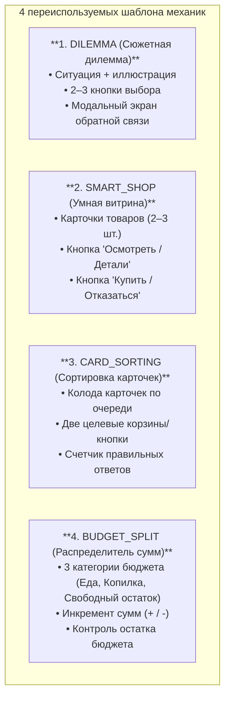

# Спецификация финансовых заданий и типовых шаблонов

Документ содержит подробное описание всех 13 игровых заданий и типовых UI-шаблонов механик.
Архитектура спроектирована по принципу **Data-Driven UI**: вся логика заданий сведена к **4 базовым
переиспользуемым Compose-шаблонам**, что позволяет реализовать все активности за 1 неделю без
верстки уникальных сцен под каждое задание (требование ТЗ п. 2.5.8 и 2.5.14).

---

## 1. Типовые шаблоны механик (Task Templates)

Все 13 заданий в приложении реализуются через следующие 4 универсальных шаблона:



### Шаблон 1: `DILEMMA` (Сюжетная дилемма)

* **Назначение:** Обучение принятию осознанных решений в неожиданных или спорных ситуациях.
* **UI-компоненты:**
    * Заголовок и иллюстрация происшествия (с эмоцией питомца).
    * Описание жизненной ситуации (1–2 коротких предложения).
    * 2 или 3 карточки выбора. Каждая карточка содержит: текст действия, стоимость в монетах (если
      есть) и иконку категории.
    * Экран последствий (BottomSheet / Dialog): реакция Финни, изменение баланса/шкал и обучающий
      вывод.
* **Используется в задачах:** №1 (Сломанный робот), №4 (Обед vs Здоровье), №8 (Подарок другу), №11 (
  Порвался рюкзак), №14 (Подарок бабушки).

### Шаблон 2: `SMART_SHOP` (Умная витрина / Сравнение товаров)

* **Назначение:** Обучение грамотному шопингу, проверке качества, защите от манипуляций и рекламы.
* **UI-компоненты:**
    * Верхняя панель: список покупок (если требуется по сюжету) и текущий баланс.
    * Витрина: 2–3 карточки товаров. На карточке: фото, название, цена.
    * Интерактивная кнопка **«Осмотреть / Отзывы»**: по клику карточка показывает скрытые свойства (
      информация о браке, реальный состав, предупреждение о скрытых затратах или рекламе).
    * Кнопка действия: «Купить» (активна) или «Отказаться / Вернуть на полку».
* **Используется в задачах:** №10 (Дисциплина списка), №13 (Выбор линейки), №12 (Проверка тетради),
  №5 (Реклама машинки), №6 (Автомат с игрушками — режим витрины «Автомат vs Магазин»).

### Шаблон 3: `CARD_SORTING` (Сортировка карточек / Две корзины)

* **Назначение:** Интерактивная классификация понятий (честный труд vs обман, обязательное vs
  желаемое).
* **UI-компоненты:**
    * Центральная карточка с текстом и иконкой ситуации.
    * Две большие кнопки внизу: зеленая `[ Честно / Безопасно ]` и красная `[ Опасно / Обман ]` (или
      свайп влево/вправо).
    * Прогресс-бар (например, 1 из 4 карточек).
* **Используется в задачах:** №17 (Честный труд).

### Шаблон 4: `BUDGET_SPLIT` (Распределитель бюджета / Конверты)

* **Назначение:** Практическое распределение дохода по трем категориям бюджета (обязательные
  расходы, копилка мечты, свободные карманные деньги / подушка безопасности).
* **UI-компоненты:**
    * Верхняя плашка: доступная сумма для распределения (динамический остаток дохода).
    * Три интерактивных блока-конверта: «Обязательное (Еда)», «Копилка мечты (Сбережения)»,
      «Карманные / Резерв».
    * Кнопки быстрого добавления (`+10`, `-10` или ползунки).
    * Кнопка «Подтвердить план бюджета».
    * **Связь со счетами:** Монеты из конвертов «Обязательное» и «Карманные» остаются на
      операционном счете (`WALLET`), а монеты из «Копилки мечты» замораживаются на счете
      сбережений (`SAVINGS`).
    * **Важно:** Этот компонент является 100% переиспользуемым ядром экрана планирования бюджета
      каждого периода (требование ТЗ п. 2.5.5).
* **Используется в задачах:** №2 (Первые конверты), а также системно на старте каждой главы.

---

## 2. Модель данных для разработчиков (Kotlin Data Contract)

Все задания описываются единой декларативной структурой данных, не требующей правки верстки:

```kotlin
enum class TaskTemplateType {
    DILEMMA,        // Сюжетный выбор из 2-3 вариантов
    SMART_SHOP,     // Витрина с осмотром скрытых свойств
    CARD_SORTING,   // Сортировка карточек по 2 категориям
    BUDGET_SPLIT,   // Распределение по трем конвертам
    SEASON_FINALE   // Праздничный финал и покупка мечты
}

data class TaskDefinition(
    val id: Int,
    val chapterNumber: Int,
    val dayNumber: Int,
    val templateType: TaskTemplateType,
    val title: String,
    val situationStory: String,
    val rewardCoins: Int,
    val options: List<TaskActionOption>,
    val educationalInsight: String
)

data class TaskActionOption(
    val id: String,
    val text: String,
    val costCoins: Int = 0,
    val inspectDetails: String? = null, // Текст скрытых свойств для SMART_SHOP
    val isCorrect: Boolean,
    val feedbackText: String,
    val statImpact: StatImpact? = null
)

data class StatImpact(
    val hungerChange: Int = 0,
    val moodImpact: PetMood? = null,    // SAD, NEUTRAL, HAPPY
    val timeTokensCost: Int = 1,        // Расход солнечных жетонов (0 или 1)
    val fundsTarget: FundType? = null   // WALLET, SAVINGS
)
```

---

## 3. Детальная спецификация всех 13 заданий

### Глава 1: Новая комната (Старт и основы бюджета)

#### Задание №2: «Первые конверты»

* **Глава:** 1 | **День:** 1
* **Тема ТЗ:** Планирование бюджета.
* **Шаблон:** `BUDGET_SPLIT`
* **Сюжетная вводная:** Финни заселился в комнату и получил стартовый капитал в 100 монет (+30 доход
  первого дня). Ему нужно распределить средства так, чтобы хватило на еду, накопления и свободные
  карманные деньги.
* **Игровой процесс:** Ребенок распределяет 120 свободных монет (за вычетом 10 на завтрак) по трем
  конвертам-категориям:
    * *Конверт 1 (Обязательное / Еда):* 40 монет (запас на питание в Кошельке).
    * *Конверт 2 (Копилка мечты):* 50 монет (отправляются в Сбережения).
    * *Конверт 3 (Карманные / Резерв):* 30 монет (подушка безопасности в Кошельке).
* **Итог на счетах:** В Кошельке остается 70 монет (40 на еду + 30 резерв), в Копилку отправлено 50
  монет.
* **Обратная связь и вывод:** «Отлично! Деньги разложены с умом: у Финни есть запас на еду, монеты в
  копилке мечты и свободный резерв в кошельке на всякий случай!»

#### Задание №17: «Честный труд»

* **Глава:** 1 | **День:** 2
* **Тема ТЗ:** Планирование бюджета (источники дохода).
* **Шаблон:** `CARD_SORTING`
* **Сюжетная вводная:** Финни хочет заработать дополнительные монеты для копилки и изучает доску
  объявлений. Помоги ему отличить полезный и честный заработок от опасных ловушек.
* **Игровой процесс:** Игроку по очереди показываются 4 карточки. Для каждой нужно нажать
  `[ Честно ]` или `[ Обман ]`:
    1. *«Помыть посуду и убрать игрушки»* $\rightarrow$ **Честно** (+10 монет).
    2. *«Перейти по подозрительной ссылке в игре за 1000 бесплатных монет»* $\rightarrow$ **Обман
       ** (Опасно! Вирусы и кража данных).
    3. *«Помочь соседу выгулять собаку»* $\rightarrow$ **Честно** (+20 монет).
    4. *«Взять без спроса чужие монеты из кармана куртки»* $\rightarrow$ **Обман** (Воровство — это
       преступление).
* **Награда:** +30 монет.
* **Обратная связь и вывод:** «Деньги зарабатываются трудом и реальной помощью, а обещания легких
  денег в интернете — это всегда ловушка мошенников!»

#### Задание №1: «Первая дилемма (Сломанный робот)»

* **Глава:** 1 | **День:** 3
* **Тема ТЗ:** Формирование сбережений (хотелка против мечты).
* **Шаблон:** `DILEMMA`
* **Сюжетная вводная:** У любимого игрушечного робота отвалилась деталь. Мастерская предлагает
  ремонт за 20 монет. Но свободных монет на текущие нужды впритык.
* **Варианты выбора:**
    * **Вариант А:** *«Забрать 20 монет из Копилки мечты и починить прямо сейчас»* (Ошибка: мечта
      отдалится, робот — не вещь первой необходимости).
    * **Вариант Б (Рекомендуемый):** *«Отложить починку робота на следующую неделю, когда появятся
      свободные карманные деньги»* (Верно: робот подождет, копилка в безопасности).
* **Обратная связь и вывод:** «Здорово! Игрушка подождет: нельзя разбивать копилку мечты ради
  сиюминутных капризов и вещей не первой необходимости!»

---

### Глава 2: Умный покупатель (Школа и магазин)

#### Задание №10: «Дисциплина списка»

* **Глава:** 2 | **День:** 1
* **Тема ТЗ:** Платежи и покупки (маркетинг у кассы).
* **Шаблон:** `SMART_SHOP`
* **Сюжетная вводная:** Финни идет в школьный буфет. В его списке покупок записана только одна
  позиция: *«Бутылка чистой воды (10 монет)»*. У кассы ярко подмигивают акционные сладости.
* **Витрина товаров:**
    * *Товар 1:* «Бутылка воды» — 10 монет (в списке).
    * *Товар 2:* «Яркий кислый леденец» — 15 монет (маркетинговая ловушка у кассы).
* **Игровой процесс:** Если ребенок добавляет леденец, бюджет превышается. Нужно купить только Воду
  и нажать «Оплатить по списку».
* **Обратная связь и вывод:** «Супер! Список покупок — твой главный щит от маркетологов. Ты сохранил
  15 монет для своей мечты!»

#### Задание №13: «Баланс цены и пользы (Выбор линейки)»

* **Глава:** 2 | **День:** 2
* **Тема ТЗ:** Платежи и покупки (соотношение цены и качества: Good / Better / Best).
* **Шаблон:** `SMART_SHOP`
* **Сюжетная вводная:** Финни на уроке геометрии нужна прочная линейка. В лавке представлены 3
  модели.
* **Витрина товаров:**
    * *Вариант 1 (Good):* Хлипкая пластиковая линейка — 5 монет. Кнопка «Осмотреть»: *«Гнется в
      руках, шкала сотрется через пару дней»*.
    * *Вариант 2 (Better, верный):* Деревянная надежная линейка — 15 монет. Кнопка «Осмотреть»:
      *«Прочная, четкие деления, прослужит весь год»*.
    * *Вариант 3 (Best, избыточный):* Линейка со встроенными часами и играми — 45 монет. Кнопка
      «Осмотреть»: *«Бесполезные функции, запрещена на контрольных, неоправданная переплата»*.
* **Игровой процесс:** Ребенок осматривает варианты и покупает надежную за 15 монет.
* **Обратная связь и вывод:** «Отличный выбор! Слишком дешевые вещи быстро ломаются и требуют новой
  покупки, а сверхдорогие с наворотами — просто пустая трата денег.»

#### Задание №12: «Внимание у прилавка (Тетрадь)»

* **Глава:** 2 | **День:** 3
* **Тема ТЗ:** Платежи и покупки (проверка товара до оплаты).
* **Шаблон:** `SMART_SHOP`
* **Сюжетная вводная:** Финни покупает тетрадь для чистописания за 10 монет. На полке лежат две
  тетради.
* **Витрина товаров:**
    * *Тетрадь 1:* Уценена до 8 монет. Кнопка «Осмотреть»: *«Обложка помята, страницы выпадают —
      писать в такой невозможно»*.
    * *Тетрадь 2:* Стандартная тетрадь за 10 монет. Кнопка «Осмотреть»: *«Плотная бумага, ровная
      разметка, без дефектов»*.
* **Игровой процесс:** Проверка товара кнопкой «Осмотреть» перед нажатием «Купить».
* **Обратная связь и вывод:** «Всегда проверяй товар перед покупкой! Бракованная вещь не принесет
  радости, даже если на нее скидка.»

---

### Глава 3: Друзья и здоровье (Нематериальные ценности)

#### Задание №4: «На чем нельзя экономить (Обед vs Здоровье)»

* **Глава:** 3 | **День:** 1
* **Тема ТЗ:** Планирование бюджета (базовые потребности).
* **Шаблон:** `DILEMMA`
* **Сюжетная вводная:** Финни загорелся желанием быстрее накопить на Телескоп и предлагает не
  обедать в школе, сэкономив 20 монет прямо в копилку.
* **Варианты выбора:**
    * **Вариант А:** *«Пропустить обед и положить 20 монет в копилку»* (Ошибка: Сытость = 0,
      Настроение падает до `Sad`, Финни урчит в животе и не может играть).
    * **Вариант Б (Верный):** *«Полноценно пообедать за 20 монет»* (Верно: Сытость = 5 (максимум), Настроение
      `Neutral`/`Happy`, Финни полон сил).
* **Обратная связь и вывод:** «Запомни: здоровье, качественная еда и безопасность — это основа.
  Экономить на собственном здоровье ради вещей нельзя никогда!»

#### Задание №8: «День рождения друга (Подарок: DIY vs Покупка)»

* **Глава:** 3 | **День:** 2
* **Тема ТЗ:** Формирование сбережений (нематериальные ценности).
* **Шаблон:** `DILEMMA`
* **Сюжетная вводная:** Щенка-друга пригласили на праздник. Финни растерян: в витрине продается
  модный робот за 70 монет (придется выгрести все сбережения), а в пенале есть идея сделать подарок
  своими руками.
* **Варианты выбора:**
    * **Вариант А:** *«Потратить 70 монет из копилки на покупную игрушку»* (Ошибка: копилка
      опустошена, подарок без души).
    * **Вариант Б (Верный):** *«Купить набор фломастеров за 5 монет и нарисовать уникальный комикс
      про приключения с другом»* (Верно: экономия 65 монет, друг в искреннем восторге).
* **Обратная связь и вывод:** «Настоящая дружба измеряется вниманием, заботой и душевным теплом, а
  не ценником в чеке!»

---

### Глава 4: Яркие ловушки (Маркетинг и азарт)

#### Задание №5: «Сказки из телевизора (Анализ рекламы)»

* **Глава:** 4 | **День:** 1
* **Тема ТЗ:** Платежи и покупки (критическое мышление).
* **Шаблон:** `SMART_SHOP`
* **Сюжетная вводная:** Финни видит красочный плакат «Летающая супер-машинка со скидкой всего за 80
  монет! Летает выше облаков!».
* **Витрина товаров:**
    * Карточка «Летающая машинка — 80 монет».
    * Кнопка «Проверить отзывы»: *«Реальные отзывы: машинка сделана из тонкого пластика, моторчик
      слабый, а дорогие батарейки нужно докупать отдельно. Никаких полетов нет!»*
* **Игровой процесс:** Нажатие кнопки «Осмотреть отзывы» разблокирует кнопку «Отказаться от
  покупки» (+30 монет за выполненный урок критического мышления).
* **Обратная связь и вывод:** «Реклама создана, чтобы продавать товар в самом красивом свете. Всегда
  читай отзывы и проверяй факты перед тратой денег!»

#### Задание №6: «Коварный автомат (Цена азарта)»

* **Глава:** 4 | **День:** 2
* **Тема ТЗ:** Платежи и покупки (азартные игры и скрытые расходы).
* **Шаблон:** `SMART_SHOP` (режим сравнения «Автомат vs Лавка»)
* **Сюжетная вводная:** Финни очень хочет плюшевого мишку. У входа в ТЦ стоит автомат с клешней (10
  монет за попытку), а рядом на полке магазина мишка продается за 25 монет.
* **Витрина товаров:**
    * *Позиция 1:* Автомат «Испытать удачу» — 10 монет / попытка.
    * *Позиция 2:* Полка магазина «Купить мишку» — 25 монет гарантированно.
* **Игровой процесс:** Если ребенок пробует автомат, клешня покачивается и роняет игрушку. Всплывает
  калькулятор: *«3 попытки = -30 монет, приз не выигран! В лавке мишка стоит 25 гарантированно»*.
  Ребенок покупает в магазине или сохраняет монеты.
* **Обратная связь и вывод:** «Автоматы с призами и лотереи запрограммированы так, чтобы забирать
  деньги. Гораздо выгоднее купить нужную вещь в магазине гарантированно!»

---

### Глава 5: Планы меняются (Подушка безопасности)

#### Задание №11: «Испытание на прочность (Порвался рюкзак)»

* **Глава:** 5 | **День:** 1
* **Тема ТЗ:** Планирование бюджета (форс-мажор и подушка безопасности).
* **Шаблон:** `DILEMMA`
* **Сюжетная вводная:** По дороге в школу у Финни с треском рвется лямка рюкзака, учебники
  рассыпаются по асфальту. Идти на уроки не с чем — новый рюкзак стоит 40 монет. Это непредвиденная
  обязательная трата!
* **Варианты выбора:**
    * **Вариант А (Верный, если сохранен резерв):** *«Оплатить 40 монет из свободного остатка
      кошелька (наша подушка безопасности)»* (Верно: благодаря привычке не тратить карманные деньги
      под ноль, рюкзак куплен из свободных денег, а Копилка мечты не пострадала!).
    * **Вариант Б (Вынужденный, если кошелек был пуст):** *«Вскрыть Копилку мечты и взять 40 монет
      оттуда»* (Печально: мечта о Телескопе отдаляется, так как свободных карманных денег не
      осталось).
* **Обратная связь и вывод:** «Вот почему важно оставлять в кошельке свободный запас монет! Если
  тратить все карманные деньги до нуля на ерунду, при любой неожиданности придется разбивать мечту!»

#### Задание №14: «Нежданный подарок от бабушки»

* **Глава:** 5 | **День:** 2
* **Тема ТЗ:** Формирование сбережений (управление внезапным доходом).
* **Шаблон:** `DILEMMA`
* **Сюжетная вводная:** На именины любимая бабушка передала Финни поздравительную открытку и конверт
  с 40 монетами. Накануне непредвиденная покупка рюкзака заметно уменьшила свободный запас в
  кошельке.
* **Варианты выбора:**
    * **Вариант А:** *«Спустить все 40 монет на аттракционы и сахарную вату»* (Ошибка: кошелек
      останется пустым, при новом форс-мажоре снова пострадает мечта).
    * **Вариант Б (Верный):** *«Отправить большую часть (+30 монет) в Копилку мечты, а +10 монет
      оставить в кошельке для укрепления резерва»* (Верно: мечта стала ближе на целых 30 монет, и
      кошелек защищен).
* **Обратная связь и вывод:** «Отличное решение! Внезапные доходы и подарки — лучший способ
  приблизить мечту и укрепить финансовую защиту!»

---

### Глава 6: Большая ярмарка (Триумф и финал)

#### Задание №18: «Сверка счетов и триумф мечты»

* **Глава:** 6 | **День:** 1
* **Тема ТЗ:** Формирование сбережений (достижение цели).
* **Шаблон:** `SMART_SHOP` (Праздничная витрина)
* **Сюжетная вводная:** Финал сезона: на главной площади шумит Городская ярмарка. Финни достает свою
  Копилку мечты: благодаря регулярным накоплениям и процентам в ней накопилось 280 монет!
* **Игровой процесс:**
    * Ребенок торжественно нажимает кнопку «Разбить копилку мечты».
    * Доступна покупка Большой Цели: **Телескоп (260 монет)** или **Набор юного художника (180
      монет)**.
    * Финни примеряет покупку, открывается праздничная анимация счастья, предмет появляется в
      комнате.
* **Обратная связь и вывод:** «Ты сделал это! Терпение, планирование и защита от лишних трат помогли
  осуществить большую мечту!»

#### Финал сезона: «Новые горизонты»

* **Глава:** 6 | **День:** 2
* **Тема ТЗ:** Планирование бюджета (рефлексия и аудит).
* **Шаблон:** `DILEMMA` / Экран аналитики
* **Сюжетная вводная:** Питомец повзрослел (3-я стадия роста). Финни дома пьет какао и просматривает
  альбом достижений.
* **Игровой процесс:** Наглядная диаграмма трат за 6 глав (доля обязательного, желаний и
  сбережений). Предложение выбрать новую цель на следующий сезон (Скейтборд за 400 монет или Домик
  для питомца за 600 монет).
* **Обратная связь и вывод:** «Финансовая грамотность — это суперсила на всю жизнь. Впереди новые
  цели и новые победы!»
