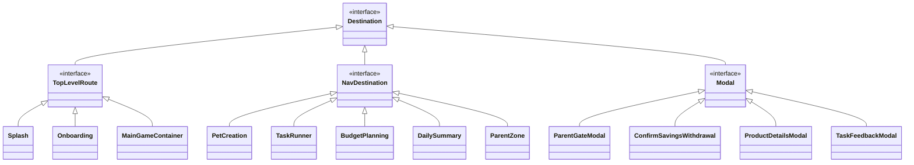

# Навигационная архитектура приложения «Питомец Финни»

Данный документ описывает структуру навигации, иерархию маршрутов и сценарии переходов в приложении **«Питомец Финни»**, спроектированные в соответствии с [Техническим заданием (ТЗ)](../game-design/TZ.md), [Геймдизайн-спецификацией](../game-design/AGENTS.md) и базовым архитектурным шаблоном проекта [`docs/core/navigation.md`](../core/navigation.md).

---

## 1. Обзор архитектуры навигации

Навигация построена на базе **Jetpack Navigation 3 (`androidx.navigation3`)** и платформо-независимого класса [`Router`](../core/navigation.md), размещенного в `shared/src/commonMain`. ViewModels и UI-компоненты вызывают методы роутера (`push`, `pop`, `switchTab`, `sendResult`) без жесткой привязки к Compose-контексту.

```mermaid
graph TD
    subgraph AppFlow [Глобальный граф навигации]
        Splash[Splash] -->|Профиль не создан| Onboarding[Onboarding & Story Intro]
        Splash -->|Профиль готов| MainTabs[MainGameContainer (4 вкладки)]
        Onboarding --> PetCreation[PetCreation: выбор и имя питомца]
        PetCreation --> FirstBudget[Первые конверты (Старт Гл.1)]
        FirstBudget --> MainTabs
    end

    subgraph BottomNav [Нижнее меню (GameBottomBar)]
        MainTabs --> TabTasks[1. Задачи (Tasks)]
        MainTabs --> TabPiggy[2. Копилка (Piggy)]
        MainTabs --> TabShop[3. Магазин (Shop)]
        MainTabs --> TabLevels[4. Уровни (Levels)]
    end

    subgraph ModalFlows [Оверлеи и модальные экраны]
        TabTasks -->|Старт задания| TaskRunner[TaskRunner: 4 UI-шаблона]
        TabPiggy -->|Выбор цели / Снятие| PiggyModals[Цели и Защита сбережений]
        TabShop -->|Осмотр товара| ProductInspection[Карточка товара / Отзывы]
        MainTabs -->|Шестеренка / Защита| ParentGate[ParentGate -> Раздел взрослого]
        MainTabs -->|Конец дня| DailySummary[Итоги дня: План vs Факт]
    end
```

### Ключевые принципы:
1. **Главный игровой экран как центральный хаб (Дом Финни):** Пользователь всегда ориентируется в параметрах питомца. Верхний HUD (сытость, настроение, кошелек, время суток) доступен постоянно.
2. **Изолированные стеки табов (`TopLevelRoute`):** Каждая вкладка нижнего бара сохраняет свое состояние при переключении. Повторный клик на активную вкладку инициирует скролл вверх (`scrollToTopEvent`).
3. **Безопасная ошибка и отсутствие тупиковых экранов (Soft-lock Guard):** Из любого экрана мини-игры, магазина или заданий есть гарантированный возврат кнопкой «Назад» или «В комнату».
4. **Оверлеи с плавной анимацией (`Modal`):** Диалоги подтверждения трат, предупреждение о снятии с копилки и экранные подсказки отображаются поверх основного экрана без уничтожения его состояния.

---

## 2. Иерархия маршрутов (`Destination.kt`)

Все пункты назначения реализуют интерфейс `Destination` и аннотируются `@Serializable`.



### 2.1. Корневые маршруты (`TopLevelRoute`)

| Маршрут | Назначение |
| :--- | :--- |
| `Splash` | Стартовый сплеш-экран: проверка локального профиля, загрузка настроек и переход. |
| `Onboarding` | Знакомство с миром Финни, целями игры и тремя типами решений («Надо», «Хочу», «Коплю»). |
| `MainGameContainer` | Основной контейнер игры с нижним меню из 4 разделов (`Задачи`, `Копилка`, `Магазин`, `Уровни`). |

### 2.2. Полноэкранные дочерние экраны (`NavDestination`)

| Маршрут | Параметры | Назначение |
| :--- | :--- | :--- |
| `PetCreation` | — | Экран настройки внешнего вида питомца и ввод игрового имени (ТЗ п. 2.5.2). |
| `BudgetPlanning` | `chapterId: Int, availableBudget: Int` | Интерактивный экран распределения личного бюджета по 3 конвертам (`BUDGET_SPLIT`). |
| `TaskRunner` | `taskId: Int, templateType: TaskTemplateType` | Прохождение финансового задания в одном из 4 типовых шаблонов (`DILEMMA`, `SMART_SHOP`, `CARD_SORTING`, `BUDGET_SPLIT`). |
| `DailySummary` | `dayNumber: Int, chapterId: Int` | Экран рефлексии и итогов дня: сравнение плана с фактом, вклад под процент, укладывание питомца спать. |
| `ParentZone` | — | Защищенный кабинет взрослого: статистика, цели, лимит глав/времени, сброс профиля. |

### 2.3. Модальные экраны и диалоги (`Modal`)

| Маршрут | Параметры | Назначение |
| :--- | :--- | :--- |
| `ParentGateModal` | `onSuccessDestination: Destination` | Математический барьер для взрослого (ТЗ п. 2.5.12). |
| `ConfirmSavingsWithdrawal` | `goalTitle: String, amount: Int, delayDays: Int` | Окно защиты накоплений от импульсивного снятия с расчетом отдаления цели (ТЗ п. 2.5.7). |
| `ProductDetailsModal` | `productId: String` | Осмотр характеристик товара и отзывов в магазине перед покупкой (`SMART_SHOP`). |
| `TaskFeedbackModal` | `isOptimal: Boolean, explanationText: String, rewardCoins: Int` | Экран объяснения последствий решения сразу после выполнения задания. |
| `EmergencyPantryModal` | — | «Аварийная полка» с бесплатной кашей при 0 монет и 0 сытости. |

---

## 3. Разделы нижнего меню основного экрана (`GameTab`)

Основной экран `MainGameContainer` включает в себя нижнюю панель навигации [`GameBottomBar`](file:///home/denis/AndroidStudioProjects/Finni/shared/src/commonMain/kotlin/com/hackathon/finni/core/ui/components/game/GameBottomBar.kt) с 4 разделами:

```kotlin
enum class GameTab(val title: String) {
    Tasks("Задачи"),
    Piggy("Копилка"),
    Shop("Магазин"),
    Levels("Уровни")
}
```

```mermaid
graph LR
    subgraph MainGameContainer [MainGameContainer (HUD всегда сверху)]
        Bar[GameBottomBar] --> Tab1[1. Задачи / Tasks]
        Bar --> Tab2[2. Копилка / Piggy]
        Bar --> Tab3[3. Магазин / Shop]
        Bar --> Tab4[4. Уровни / Levels]
    end
```

### 1. Раздел «Задачи» (`GameTab.Tasks`)
* **Роль:** Основной игровой хаб и комната Финни.
* **Содержимое:**
  * Интерактивная 2D/3D комната с питомцем Финни (анимации, реакции на прикосновения);
  * Визуализация полупрозрачной «Копилки мечты» прямо в интерьере;
  * Виджет активного сюжетного квеста дня с кнопкой «Играть / Выполнить»;
  * Список доступных викторин и мини-заданий главы;
  * Кнопка перехода к планированию бюджета (в фазе Утра) или завершению дня (в фазе Вечера).

### 2. Раздел «Копилка» (`GameTab.Piggy`)
* **Роль:** Управление целевыми сбережениями и долгосрочной мотивацией (ТЗ п. 2.5.7).
* **Содержимое:**
  * Выбор или сменяемость текущей финансовой цели (Телескоп: 200 монет, Набор художника: 120 монет, Мяч: 60 монет);
  * Наглядный прогресс накоплений (заполняющаяся шкала / раскрашиваемый предмет);
  * Быстрый перевод свободных монет из кошелька в копилку (`+10`, `+25`, `Вся сдача`);
  * Кнопка частичного снятия средств с предупреждением об отдалении мечты;
  * Индикатор пассивного процента (+5% за каждые 3 дня финансовой дисциплины).

### 3. Раздел «Магазин» (`GameTab.Shop`)
* **Роль:** Отработка практических покупок, приоритизация «Надо» vs «Хочу» (ТЗ п. 2.5.6).
* **Содержимое:**
  * Вкладки каталога: **«Еда и уход»** (обязательные расходы для пополнения сытости) и **«Игрушки и уют»** (необязательные траты для настроения);
  * Карточки товаров с ценой, описанием и влиянием на параметры питомца (`+1 Сытость`, `+1 Настроение`);
  * Подтверждение покупки перед оплатой;
  * Защита от отрицательного баланса с дружелюбным объяснением: *«В кошельке не хватает 5 монет. Можно выполнить задание или заглянуть на аварийную полку!»*.

### 4. Раздел «Уровни» (`GameTab.Levels`)
* **Роль:** Карта прогресса сквозного сюжета из 6 глав и ретроспектива (ТЗ п. 2.5.10, 2.5.11).
* **Содержимое:**
  * Интерактивная карта 6 локаций (Дом Финни, Канцелярская лавка, Городской парк, Торговый центр, Мастерская, Ярмарочная площадь);
  * Статус глав (Пройдено, Текущая, Заблокировано);
  * Календарь текущего игрового периода (День 1, День 2, День 3 главы);
  * Доступ к финансовому словарику терминов («Бюджет», «Накопления», «Обязательное», «Импульсивная покупка»).

---

## 4. Сквозные пользовательские сценарии (User Flows)

### Сценарий А: Первый запуск и старт игры (Шаги 1–5 ТЗ)
1. `Splash` определяет, что профиль отсутствует $\rightarrow$ переход на `Onboarding`.
2. На `Onboarding` ребенок листает 3 интерактивных слайда с озвучкой/короткими фразами $\rightarrow$ кнопка «Познакомиться с Финни».
3. Переход на `PetCreation`: выбор цвета шерстки, аксессуара, ввод простого игрового имени $\rightarrow$ «Создать друга».
4. Запуск Главы 1: `Router.push(BudgetPlanning(chapterId = 1, budget = 100))`.
5. Ребенок распределяет 100 монет по трем конвертам $\rightarrow$ нажимает «Утвердить бюджет».
6. Роутер переключает стек на `MainGameContainer(selectedTab = Tasks)`.

### Сценарий Б: Выполнение финансового задания (Шаг 6 ТЗ)
1. На вкладке `Tasks` ребенок нажимает карточку активного задания (например, задание №17 «Честный труд»).
2. `Router.push(TaskRunner(taskId = 17, templateType = CARD_SORTING))`.
3. Ребенок сортирует карточки по корзинам «Честный доход» / «Обман».
4. По завершении открывается `TaskFeedbackModal`:
   - Начисление +30 монет в кошелек;
   - Короткое объяснение: *«Деньги, заработанные честным трудом, приносят радость и уверенность!»*;
   - Обновление индикатора настроения питомца на `Happy`.
5. Нажатие кнопки «Отлично!» возвращает ребенка на `Tasks`, расходуя 1 солнечный жетон времени.

### Сценарий В: Покупка в магазине и проверка баланса (Шаг 7 ТЗ)
1. Ребенок переходит на вкладку `Shop`.
2. Выбирает предмет (например, «Праздничный торт» за 50 монет при балансе 20 монет).
3. При нажатии «Купить» открывается модальное окно с предупреждением о нехватке средств и альтернативами (выполнить задание или купить обычное яблоко за 10 монет).
4. Ребенок покупает «Сытный обед» за 10 монет $\rightarrow$ с кошелька списывается 10 монет, шкала сытости восполняется на +2 деления.

### Сценарий Г: Копилка и защита от снятия (Шаг 8 ТЗ)
1. Ребенок переходит на вкладку `Piggy`.
2. Вводит +20 монет в «Копилку мечты» $\rightarrow$ прогресс цели (Телескоп) вырастает до 110/200 монет.
3. При попытке нажать «Забрать монеты» открывается `ConfirmSavingsWithdrawal`:
   - Сообщение: *«Если забрать 20 монет сейчас, покупка Телескопа отдалится на 2 дня! Точно забрать?»*;
   - Две кнопки: «Оставить в копилке» (рекомендуемая, яркая) и «Все равно забрать».

### Сценарий Д: Переход в раздел для взрослого (Шаг 12 ТЗ)
1. На основном экране в верхнем баре нажимается иконка шестеренки `ic_game_gear`.
2. Открывается `ParentGateModal`: математический пример (например, `8 × 7 = ?`) или удержание кнопки 3 секунды.
3. При успешном вводе: `Router.push(ParentZone)`.
4. В разделе для взрослого доступны:
   - Общий прогресс ребенка и освоенные финансовые навыки;
   - Переключатель лимита глав в день (1 глава / 2 главы / без лимита);
   - Кнопка «Сбросить демо-профиль» (для экспертной проверки хакатона).

---

## 5. Типизированные результаты навигации (`NavigationResult`)

В соответствии с [`docs/core/navigation.md`](../core/navigation.md) экраны обмениваются результатами через типизированные каналы:

```kotlin
sealed interface GameNavigationResult : NavigationResult

// Результат прохождения задания
@Serializable
data class TaskCompletedResult(
    val taskId: Int,
    val earnedCoins: Int,
    val isSuccess: Boolean
) : GameNavigationResult

// Результат планирования бюджета
@Serializable
data class BudgetConfirmedResult(
    val mandatoryAmount: Int,
    val savingsAmount: Int,
    val freeAmount: Int
) : GameNavigationResult

// Результат подтверждения снятия с копилки
@Serializable
data class SavingsWithdrawalConfirmed(
    val amountToWithdraw: Int
) : GameNavigationResult
```

### Пример приема результата во ViewModel:
```kotlin
class TasksViewModel(
    private val router: Router
) : ViewModel() {

    fun onStartTask(task: TaskItem) {
        viewModelScope.launch {
            router.push(TaskRunner(taskId = task.id, templateType = task.templateType))
            
            val result = router.receiveResult<TaskCompletedResult>()
            if (result != null && result.isSuccess) {
                // Обновляем кошелек и расходуем жетон времени
                onTaskSuccess(result.earnedCoins)
            }
        }
    }
}
```
