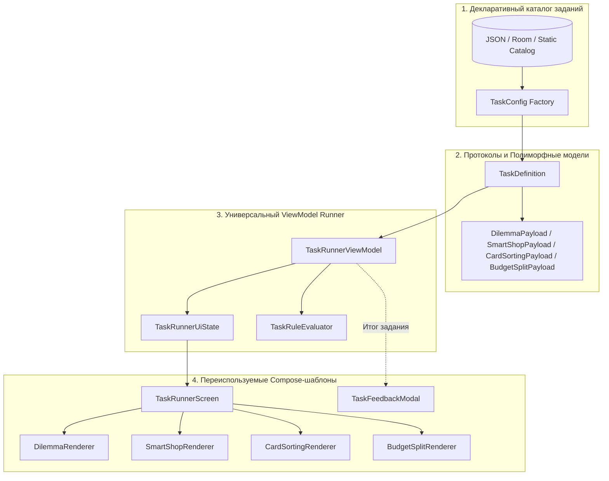

# Спецификация движка заданий (Tasks Engine)

Данный документ описывает архитектуру, протоколы данных и систему выполнения финансовых заданий в приложении **«Питомец Финни»**. 

Архитектура построена на принципах **Data-Driven UI** и **полиморфной конфигурации**: ни один тип задания не привязан жестко к конкретной локации, сюжетной главе или фиксированным товарам. Контент заданий полностью отделен от механизмов рендеринга и может расширяться или загружаться динамически без изменения кода экранов (требования **ТЗ п. 2.5.8** и **п. 2.5.14**).

---

## 1. Архитектурная концепция

Движок заданий состоит из 4 изолированных уровней:



### Ключевые принципы движка:
1. **Изоляция контента от движка (Content Agnostic):** Шаблон «Умная витрина» одинаково успешно отображает канцтовары в школе, продукты в супермаркете или проверку рекламы в торговом центре.
2. **Гарантированная обратная связь (Explainable Learning):** Независимо от оптимальности выбора ребенок получает понятное объяснение причины и следствия без штрафов и стыда (ТЗ п. 2.5.9).
3. **Единый контракт наград и воздействия на питомца (`StatImpact`):** Любой исход формирует структурированное изменение баланса кошелька, копилки, сытости, настроения и жетонов времени.
4. **Легкая масштабируемость:** Добавление 10 новых заданий — это добавление 10 объектов конфигурации в каталог, без создания новых Compose-функций или ViewModels.

---

## 2. Базовые протоколы и общие контракты данных

### 2.1. Обобщенная модель задания (`TaskDefinition`)

```kotlin
enum class TaskTemplateType {
    DILEMMA,        // Сюжетный выбор из 2-3 альтернатив
    SMART_SHOP,     // Умная витрина со скрытыми свойствами и проверкой качества
    CARD_SORTING,   // Интерактивная сортировка колоды по 2 корзинам
    BUDGET_SPLIT    // Распределение суммы по N интерактивным конвертам
}

@Serializable
data class TaskDefinition(
    val id: Int,
    val title: String,
    val subtitle: String? = null,
    val topic: FinancialTopic,           // BUDGET, SAVINGS, SHOPPING, CRITICAL_THINKING
    val templateType: TaskTemplateType,
    val timeCostTokens: Int = 1,         // Расход жетонов дня (обычно 1)
    val maxRewardCoins: Int,             // Базовая награда за успешное/вдумчивое решение
    val payload: TaskPayload             // Полиморфная конфигурация конкретного типа
)

enum class FinancialTopic {
    BUDGET_PLANNING,       // Планирование личного бюджета
    SAVINGS_AND_GOALS,     // Формирование сбережений и финансовая цель
    SMART_SHOPPING,        // Осознанные покупки и качество
    FINANCIAL_SECURITY     // Безопасность, честный труд и критическое мышление
}
```

### 2.2. Контракт последствий и наград (`StatImpact`)

Каждое действие ребенка в задании возвращает стандартизированный эффект:

```kotlin
@Serializable
data class StatImpact(
    val walletCoinDelta: Int = 0,         // Изменение баланса кошелька (+доход или -расход)
    val savingsCoinDelta: Int = 0,        // Изменение копилки (если решение затрагивает цель)
    val hungerDelta: Int = 0,             // Изменение сытости (-2..+2)
    val moodTarget: PetMood? = null,      // SAD, NEUTRAL, HAPPY
    val isOptimalChoice: Boolean = true,  // Оптимальность решения для статистики
    val feedbackMessage: String,          // Короткое объяснение последствий (1-2 предложения)
    val educationalInsight: String        // Вывод/правило для закрепления («Почему это важно»)
)
```

---

## 3. Спецификация 4 типов заданий и вариативность параметров

---

### Шаблон 1: `DILEMMA` (Сюжетная дилемма)

#### Суть механики:
Пользователь оказывается в жизненной ситуации выбора между 2–3 взаимоисключающими действиями (например, «Срочно починить игрушку сейчас» vs «Сохранить деньги на подарок другу»).

```
┌────────────────────────────────────────────────────────┐
│  [Иллюстрация ситуации: 🤖 Сломанный робот]            │
│  «У робота села батарейка! Друг зовет гулять,          │
│   но в кармане всего 20 монет...»                      │
├────────────────────────────────────────────────────────┤
│  [ Вариант A: Купить батарейку (-20 🪙) ]              │
│  [ Вариант B: Починить самому с другом (Бесплатно) ]   │
│  [ Вариант C: Отложить починку и убрать на полку ]     │
└────────────────────────────────────────────────────────┘
```

#### Протокол конфигурации (`DilemmaPayload`):
```kotlin
@Serializable
data class DilemmaPayload(
    val situationText: String,
    val illustrationAsset: String,       // Имя векторного/растрового ресурса
    val petReactionInitial: PetMood,     // Стартовая эмоция (например, SAD при поломке)
    val choices: List<DilemmaChoice>     // От 2 до 4 вариантов выбора
) : TaskPayload

@Serializable
data class DilemmaChoice(
    val id: String,
    val text: String,
    val costCoins: Int = 0,              // Стоимость действия (0 = бесплатно)
    val iconResName: String? = null,     // Иконка действия
    val impact: StatImpact               // Последствия выбора
)
```

#### Что может варьироваться:
| Параметр | Возможные значения | На что влияет в игре |
| :--- | :--- | :--- |
| **Количество альтернатив** | 2, 3 или 4 варианта | Сложность выбора: от бинарного («Да/Нет») до многофакторного с компромиссами. |
| **Финансовый характер выбора** | Платный, бесплатный, доходный | Проверка готовности потратить кошелек, найти творческую альтернативу или заработать. |
| **Влияние на шкалы питомца** | Изменение сытости, настроения | Обучение тому, что не все решения измеряются только деньгами (здоровье и дружба важнее). |
| **Оптимальность** | Единственно верный или «Выбор без единого ответа» | Возможность дилемм, где оба варианта допустимы, но формируют разный опыт. |

---

### Шаблон 2: `SMART_SHOP` (Умная витрина и сравнение)

#### Суть механики:
Ребенок учится осознанному потреблению: на витрине представлено 2–4 товара. Прежде чем совершить покупку, ребенок может **«Осмотреть товар» / «Прочитать отзывы» / «Проверить состав»**, вскрывая скрытые дефекты, маркетинг или реальное качество.

```
┌────────────────────────────────────────────────────────┐
│  Цель: «Купи надежную линейку для школы»               │
├────────────────────────────────────────────────────────┤
│ ┌────────────────┐ ┌────────────────┐ ┌──────────────┐ │
│ │ [Линейка 1]    │ │ [Линейка 2]    │ │ [Линейка 3]  │ │
│ │ 5 🪙           │ │ 15 🪙 (Выбор!) │ │ 45 🪙        │ │
│ │ «Супер-дешево» │ │ «Прочный пластик»│ «С играми!»  │ │
│ │ [ Осмотреть ]  │ │ [ Осмотреть ]  │ │ [ Осмотреть ]│ │
│ │ [ Купить ]     │ │ [ Купить ]     │ │ [ Купить ]   │ │
│ └────────────────┘ └────────────────┘ └──────────────┘ │
│ [ 🚪 Уйти без покупок / Отказаться от всех ]           │
└────────────────────────────────────────────────────────┘
```

#### Протокол конфигурации (`SmartShopPayload`):
```kotlin
@Serializable
data class SmartShopPayload(
    val shoppingGoalPrompt: String,      // Подсказка/список (например: «Выбери тетрадь без брака»)
    val allowLeaveWithoutBuying: Boolean,// Разрешена ли кнопка «Отказаться от покупки»
    val leaveImpact: StatImpact? = null, // Последствия отказа (например, защита от обмана в автомате)
    val items: List<SmartShopItem>       // 2–4 сравниваемых товара
) : TaskPayload

@Serializable
data class SmartShopItem(
    val id: String,
    val title: String,
    val price: Int,
    val imageAsset: String,
    val frontBadgeText: String? = null,  // «Акция!», «Новинка», «Супер-цена»
    val inspectDetails: InspectionData,  // Скрытая информация, раскрываемая по клику
    val onBuyImpact: StatImpact          // Последствия покупки данного товара
)

@Serializable
data class InspectionData(
    val description: String,             // «Пластик очень хрупкий, сломается в первый же день»
    val qualityRating: Int,              // 1..5 звезд
    val hasHiddenDefect: Boolean,        // Брак / ловушка
    val realBenefitHint: String          // «Обычная линейка с надежной шкалой»
)
```

#### Что может варьироваться:
| Параметр | Возможные значения | На что влияет в игре |
| :--- | :--- | :--- |
| **Количество товаров** | 2, 3 или 4 карточки | Сравнение двух альтернатив («Дешевое vs Надежное») или сложная витрина. |
| **Наличие скрытого дефекта** | `hasHiddenDefect: true/false` | Учит осматривать товар до передачи денег продавцу. |
| **Режим «Анти-ловушка»** | `allowLeaveWithoutBuying: true` | Сценарии с рекламой или азартными автоматами, где правильное решение — **не покупать ничего**. |
| **Проверка на покупку вслепую** | Флаг `wasInspectedBeforeBuy` | Если ребенок купил товар без осмотра — получает дополнительный урок: *«Ты не проверил товар перед покупкой!»*. |

---

### Шаблон 3: `CARD_SORTING` (Сортировка карточек по категориям)

#### Суть механики:
Колода из $N$ карточек предъявляется поочередно. Ребенок классифицирует каждую карточку в одну из двух целевых корзин/кнопок (например: «Честный доход» vs «Обман», или «Обязательное (Надо)» vs «Желание (Хочу)»).

```
┌────────────────────────────────────────────────────────┐
│  Карточка 2 из 4                                       │
│ ┌────────────────────────────────────────────────────┐ │
│ │                                                    │ │
│ │   [ 📱 Иконка: «Вы выиграли 100 000 рублей!        │ │
│ │          Перейдите по ссылке в СМС» ]              │ │
│ │                                                    │ │
│ └────────────────────────────────────────────────────┘ │
│                                                        │
│   [ 🟢 Честно и безопасно ]    [ 🔴 Опасно / Обман ]   │
└────────────────────────────────────────────────────────┘
```

#### Протокол конфигурации (`CardSortingPayload`):
```kotlin
@Serializable
data class CardSortingPayload(
    val deckTitle: String,               // «Определи источник дохода»
    val basketLeft: SortingBasket,       // Левая корзина/кнопка
    val basketRight: SortingBasket,      // Правая корзина/кнопка
    val cards: List<SortingCard>,        // Список карточек в колоде (от 3 до 8)
    val completionReward: StatImpact     // Награда по итогам разбора всей колоды
) : TaskPayload

@Serializable
data class SortingBasket(
    val id: String,                      // e.g. "HONEST_WORK", "SCAM", "MANDATORY", "DESIRE"
    val title: String,                   // Название кнопки
    val iconResName: String,
    val colorHex: String                 // Цвет кнопки/корзины
)

@Serializable
data class SortingCard(
    val id: String,
    val text: String,
    val imageAsset: String? = null,
    val correctBasketId: String,         // К какой корзине относится
    val explanationOnDrop: String        // Мгновенная обратная связь при сортировке
)
```

#### Что может варьироваться:
| Параметр | Возможные значения | На что влияет в игре |
| :--- | :--- | :--- |
| **Тематика корзин** | Любые 2 категории | «Честно vs Обман», «Надо vs Хочу», «Безопасный пароль vs Утечка», «Польза vs Вред». |
| **Размер колоды** | 3 – 8 карточек | Длительность и глубина упражнения (обычно 4 карточки на 1–2 минуты игры). |
| **Механика ответа** | Тап по кнопкам корзин или свайп влево/вправо | Поддержка сенсорных жестов на мобильных устройствах. |
| **Штраф за ошибку** | Мягкое исправление | Карточка не сгорает, а объясняет ошибку и дает ребенку переместить ее в правильную корзину. |

---

### Шаблон 4: `BUDGET_SPLIT` (Распределитель бюджета по конвертам)

#### Суть механики:
Ребенок получает стартовую сумму (доход периода или главы) и должен распределить ее по $K$ интерактивным конвертам при помощи кнопок инкремента (`+10` / `-10`) до тех пор, пока весь бюджет не будет распределен.

```
┌────────────────────────────────────────────────────────┐
│  Доступно для распределения: 0 🪙  (Всего: 120 🪙)     │
├────────────────────────────────────────────────────────┤
│ ┌────────────────────────────────────────────────────┐ │
│ │ 🍲 Обязательное (Еда и уход)        [ - ] 40 🪙 [ + ]│ │
│ └────────────────────────────────────────────────────┘ │
│ ┌────────────────────────────────────────────────────┐ │
│ │ 🎯 Копилка мечты (Сбережения)       [ - ] 50 🪙 [ + ]│ │
│ └────────────────────────────────────────────────────┘ │
│ ┌────────────────────────────────────────────────────┐ │
│ │ 👛 Карманные деньги (Резерв)        [ - ] 30 🪙 [ + ]│ │
│ └────────────────────────────────────────────────────┘ │
│                                                        │
│             [ Утвердить бюджет периода ]               │
└────────────────────────────────────────────────────────┘
```

#### Протокол конфигурации (`BudgetSplitPayload`):
```kotlin
@Serializable
data class BudgetSplitPayload(
    val totalBudget: Int,                // Общая сумма дохода для распределения
    val stepIncrement: Int = 10,         // Шаг изменения (+10, +5)
    val envelopes: List<BudgetEnvelopeConfig>, // Конфигурация конвертов (2–4 шт.)
    val validationRule: BudgetValidationRule = BudgetValidationRule.EXACT_MATCH,
    val completionImpact: StatImpact     // Награда и пересчет счетов
) : TaskPayload

@Serializable
data class BudgetEnvelopeConfig(
    val id: String,                      // "MANDATORY", "SAVINGS", "RESERVE", "CHARITY"
    val title: String,                   // Название конверта
    val iconResName: String,
    val minAmount: Int = 0,              // Минимальная планка (например, на еду нельзя 0)
    val recommendedAmount: Int? = null,  // Рекомендуемая подсказка (например, 50% / 30% / 20%)
    val targetFund: FundType             // WALLET или SAVINGS
)

enum class BudgetValidationRule {
    EXACT_MATCH,       // Сумма строго равна totalBudget (остаток 0)
    ALLOW_SURPLUS      // Разрешено распределить меньше, остаток идет в свободный кошелек
}

enum class FundType {
    WALLET,            // Операционный кошелек (тратится в течение дня)
    SAVINGS            // Замороженные сбережения копилки мечты
}
```

#### Что может варьироваться:
| Параметр | Возможные значения | На что влияет в игре |
| :--- | :--- | :--- |
| **Количество конвертов** | 2, 3 или 4 конверта | От базового «Траты vs Копилка» до классического «Обязательное / Мечта / Подушка безопасности». |
| **Ограничение минимальной суммы** | `minAmount > 0` | Защита от голодания питомца: нельзя отправить 0 монет в обязательные расходы на еду. |
| **Связка с реальными счетами** | `targetFund: WALLET / SAVINGS` | Монеты из конверта «Копилка» автоматически поступают на счет накоплений. |

---

## 4. Архитектура ViewModel и состояние (`TaskRunnerUiState`)

Управление выполнением любого типа задания осуществляется единой `TaskRunnerViewModel` в соответствии с [`docs/core/viewmodel-layer.md`](../core/viewmodel-layer.md).

```kotlin
data class TaskRunnerUiState(
    val isLoading: Boolean = false,
    val taskDefinition: TaskDefinition? = null,

    // Специфичные состояния для разных типов (активно только одно):
    val dilemmaState: DilemmaUiState = DilemmaUiState(),
    val smartShopState: SmartShopUiState = SmartShopUiState(),
    val cardSortingState: CardSortingUiState = CardSortingUiState(),
    val budgetSplitState: BudgetSplitUiState = BudgetSplitUiState(),

    // Модальный экран результата задания
    val activeFeedback: StatImpact? = null,
    val isCompleted: Boolean = false
)

data class DilemmaUiState(
    val selectedChoiceId: String? = null
)

data class SmartShopUiState(
    val inspectedItemIds: Set<String> = emptySet(),
    val selectedItemId: String? = null
)

data class CardSortingUiState(
    val currentCardIndex: Int = 0,
    val correctDropsCount: Int = 0,
    val lastDropExplanation: String? = null
)

data class BudgetSplitUiState(
    val envelopeAllocations: Map<String, Int> = emptyMap(),
    val remainingToAllocate: Int = 0,
    val isValidToSubmit: Boolean = false
)
```

### Публичные действия во ViewModel (`on<Action>`):
```kotlin
class TaskRunnerViewModel(
    private val taskId: Int,
    private val tasksRepository: TasksRepository,
    private val economyRepository: EconomyRepository,
    private val petRepository: PetRepository,
    private val router: Router,
    private val errorHandler: ErrorHandler,
    private val eventHandler: EventHandler
) : ViewModel(), ErrorHandler by errorHandler {

    private val _uiState = MutableStateFlow(TaskRunnerUiState(isLoading = true))
    val uiState: StateFlow<TaskRunnerUiState> = _uiState.asStateFlow()

    init {
        loadTask(taskId)
    }

    // --- События шаблона DILEMMA ---
    fun onDilemmaOptionSelected(choiceId: String) { ... }

    // --- События шаблона SMART_SHOP ---
    fun onSmartShopInspectItem(itemId: String) { ... }
    fun onSmartShopBuyItem(itemId: String) { ... }
    fun onSmartShopLeaveWithoutBuying() { ... }

    // --- События шаблона CARD_SORTING ---
    fun onCardDropToBasket(cardId: String, targetBasketId: String) { ... }

    // --- События шаблона BUDGET_SPLIT ---
    fun onEnvelopeAmountChanged(envelopeId: String, delta: Int) { ... }
    fun onConfirmBudgetSplit() { ... }

    // --- Общие события завершения ---
    fun onFeedbackDismissed() {
        val impact = _uiState.value.activeFeedback ?: return
        // Отправка результата вызывающему экрану и закрытие
        router.popWithResult(
            TaskCompletedResult(
                taskId = taskId,
                earnedCoins = impact.walletCoinDelta,
                isSuccess = impact.isOptimalChoice
            )
        )
    }
}
```

---

## 5. Модальное окно обратной связи (`TaskFeedbackModal`)

После совершения любого финального действия в шаблоне открывается экран обратной связи (ТЗ п. 2.5.9):

1. **Эмоциональная реакция Финни:** анимированная иконка или изображение (радость при верном выборе, задумчивость при неоптимальном).
2. **Балансовые плашки:**
   - Начислено в кошелек: `+30 🪙`;
   - Изменение настроения: `😊 Счастлив`;
   - Расход времени дня: `1 ☀️`.
3. **Объяснение («Что произошло»):** понятный текст для ребенка 7–11 лет.
4. **Педагогический вывод («Почему это важно»):** золотое правило финансовой грамотности.
5. **Большая кнопка «Отлично / Понятно»:** закрывает модал, обновляет состояние игры и расходует жетон времени.
